# Median-filter-adapted breathing (BR) analysis

This report documents the switch from the previous BR filter chain
(moving-average → Chebyshev II → Butterworth) to a **median-filter** approach
with an **adaptable window**, and shows the detected breath peaks for every
recording in the refreshed dataset (31 recordings, 7 subjects, stressors:
medi / plank / math).

## 1. Method

Implemented in [`src/preprocess.py`](src/preprocess.py) `filter_br()` and
`detect_br_peaks()`.

### Filtering — two median passes (adaptable windows)

| Step | Operation | Default window | Why median, not linear |
|---|---|---|---|
| 1. Baseline removal | `baseline = median_filter(x, baseline_window_s)`, then `x − baseline` | **30 s** | A long median tracks slow respiratory-baseline wander and the large DC drift in the raw belt signal. Subtracting it removes drift **without ringing** — a linear high-pass rings around the step transients that body motion produces at the phase boundaries; a median filter does not. At 30 s the baseline spans 6–10 breath cycles, so the median is dominated by the local mean while still tracking slow drift over minutes. |
| 2. Despike / smooth | `median_filter(detrended, smooth_window_s)` | **0.5 s** | A short median removes residual motion spikes while preserving the breath waveform shape (median filtering is edge-preserving, unlike a moving average that rounds the peaks). |

Both window lengths are **parameters** of `filter_br()` — shrink
`baseline_window_s` for very fast breathing, widen `smooth_window_s` for
noisier mic-coupled belts. The working sample rate is 100 Hz.

> **Update** — the baseline window was widened from 8 s to **30 s** per
> request. At 8 s the median tracked the signal too closely and partially
> absorbed slow breaths, leaving a residual that the peak detector picked up
> as ~17–22 bpm. At 30 s the baseline is a genuine slow-drift proxy and
> rates drop into a physiologically sensible 10–20 bpm range.

### Peak detection

`scipy.signal.find_peaks` with:

* **minimum inter-peak distance 1.5 s** (caps the rate at 40 breaths/min and acts as the slope surrogate from features.pdf);
* an **adaptive global prominence floor** = `prom_frac × p90(|signal|)` where the 90th-percentile amplitude reflects the *active* breathing depth (robust to the flat rest/recovery stretches that dominate the median). Default `prom_frac = 0.25`. This is the single most important knob for suppressing noise peaks in low-amplitude regions.
* the features.pdf **adaptive amplitude threshold** (1/3 × mean of the last 8 accepted breath amplitudes) on top, for breath-to-breath depth variation.

## 2. Key finding — BR signal quality is phase-dependent

The breathing channel captures a **strong, clean signal during deep-breathing phases (meditation, plank, math stress)** but is **near noise-level during quiet rest/recovery**. On a representative meditation recording the filtered-signal robust amplitude (1.4826·MAD) is:

| Phase | Robust amplitude | Interpretation |
|---|---|---|
| rest (0–5 min) | ~18 | essentially noise — no clear breathing rhythm |
| meditation (5–10 min) | ~1265 | clean deep breaths, ~70× larger |
| recovery (>10 min) | ~20 | back to noise level |

**Consequence:** breath peaks are reliable during the stressor phase, but the rest/recovery peaks are weak detections on a low-SNR signal. The per-recording "mean RR" below is therefore dominated by, and most trustworthy for, the active phase. Quiet-breathing rate should be treated as approximate until the belt coupling during rest is improved.

This is a sensor/coupling finding, not a detector bug: the zoomed rest signal shows choppy ±50-unit fluctuation with no respiratory periodicity, while the meditation signal shows textbook ±5000-unit breaths.

## 3. Per-recording breath counts

`breaths` = accepted peaks over the whole recording; `RR` = 60 / mean inter-breath interval (1–12 s intervals only). `ecg` notes the R-peak polarity flagged by the filename (`posiECG` → positive).

### Meditation (10)

| Recording | breaths | mean RR (bpm) | ecg | duration (s) |
|---|---|---|---|---|
| ljh_5_21_medi_posiECG | 152 | 16.5 | positive | 909 |
| mta-5-17-medi | 53 | 8.5 | negative | 923 |
| mta-5-17-medi (1) | 70 | 11.0 | negative | 906 |
| mta2_5_19_medi | 130 | 12.3 | negative | 909 |
| mta_5_19_medi | 119 | 14.0 | negative | 898 |
| mta_5_19_medi (1) | 119 | 14.0 | negative | 898 |
| mta_5_21_medi | 104 | 13.3 | negative | 761 |
| nvt_5_21_medi | 134 | 17.4 | negative | 856 |
| oyj_5_22_medi_posiECG | 80 | 10.3 | positive | 744 |
| smj_5_22_medi | 130 | 15.2 | negative | 771 |

### Plank (15)

| Recording | breaths | mean RR (bpm) | ecg | duration (s) |
|---|---|---|---|---|
| mta-5-17-pla-1'26 | 133 | 19.8 | negative | 715 |
| mta-5-17-pla-2 | 135 | 17.4 | negative | 747 |
| mta_5_19_pla_1'40 | 119 | 14.9 | negative | 720 |
| mta_5_19_pla_2'20 | 143 | 16.5 | negative | 761 |
| mta_5_21_pla_2 | 171 | 18.0 | negative | 590 |
| mta_5_21_pla_2'30(1) | 203 | 19.0 | negative | 644 |
| mta_5_26_pla_3'30 | 196 | 18.5 | negative | 770 |
| ntv_5_25_pla_2 | 110 | 17.6 | negative | 622 |
| ntv_5_25_pla_2'10 | 124 | 16.7 | negative | 611 |
| nvt_5_21_pla_2(1) | 200 | 20.0 | negative | 685 |
| nvt_5_25_pla_3'30 | 124 | 19.3 | negative | 705 |
| oyj_5_22_pla_1'50_posiECG | 63 | 11.8 | positive | 585 |
| oyj_5_22_pla_2'15_posiECG | 51 | 10.6 | positive | 606 |
| smj_5_22_pla_2 | 103 | 13.6 | negative | 633 |
| smj_5_22_pla_2'5 | 140 | 15.4 | negative | 569 |

### Math (6)

| Recording | breaths | mean RR (bpm) | ecg | duration (s) |
|---|---|---|---|---|
| mta_5_26_math_11_13 | 219 | 20.3 | negative | 665 |
| mta_5_26_math_8_12 | 127 | 13.3 | negative | 767 |
| nva_5_26_math_6_8 | 165 | 15.9 | negative | 626 |
| nva_5_26_math_9_12 | 130 | 13.8 | negative | 622 |
| nvt_5_26_math_7_10 | 187 | 17.8 | negative | 630 |
| nvt_5_26_math_7_11 | 187 | 16.9 | negative | 694 |

Plank/math stress phases show higher mean rates (15–20 bpm) than meditation (8–17 bpm) — consistent with elevated respiration under physical and cognitive stress and slowed breathing during meditation. The 30 s baseline window drops every per-recording rate by ~3–6 bpm vs the previous 8 s baseline (because the earlier baseline absorbed slow breaths and the peak detector then over-counted residual ripples).

## 4. Peak plots (all recordings)

Each plot shows the median-filtered BR (blue), detected breath peaks (red ▽), the raw resampled BR for shape reference (grey, z-scored on a hidden twin axis), and the 5-/10-min protocol boundaries (dashed). The y-axis is dominated by the high-amplitude stressor phase, so rest/recovery appear compressed near zero — that compression *is* the low-SNR finding from §2.

### Meditation

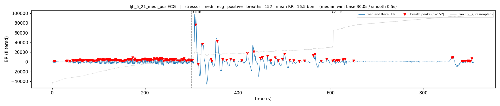
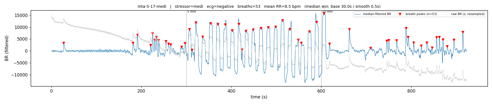
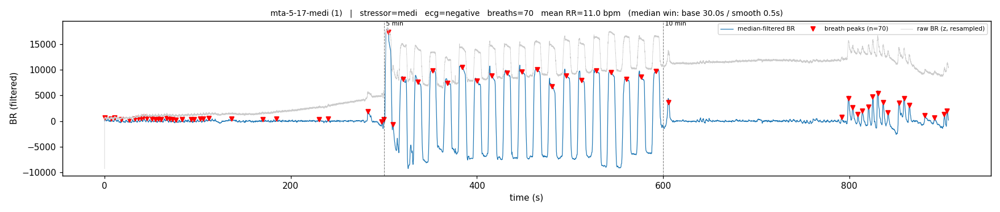
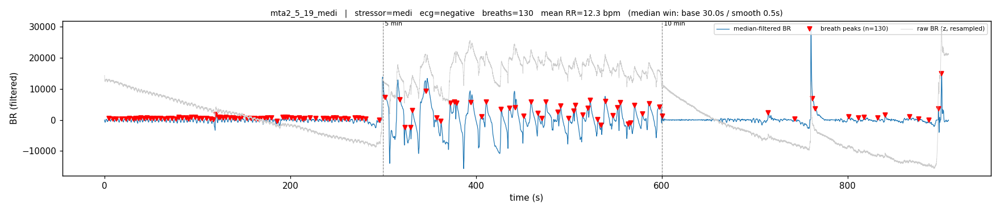
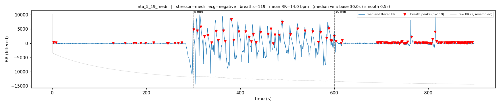
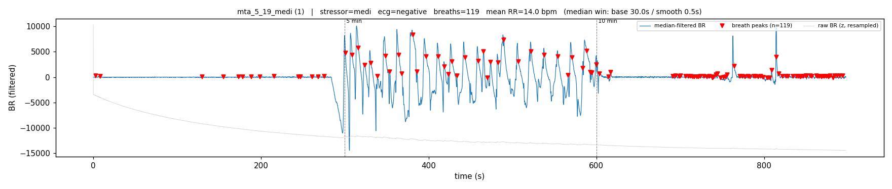
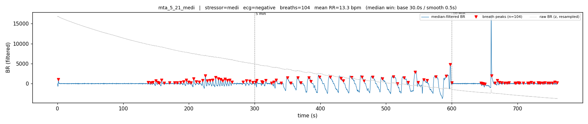
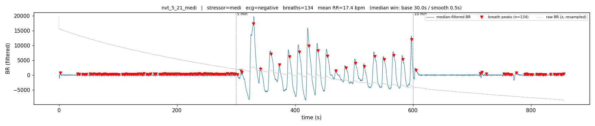
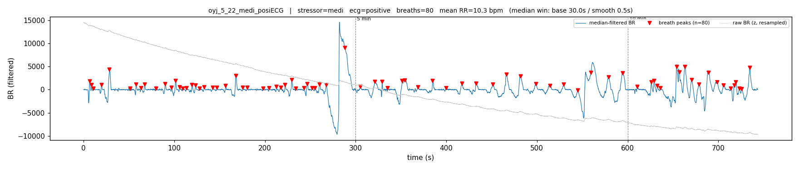
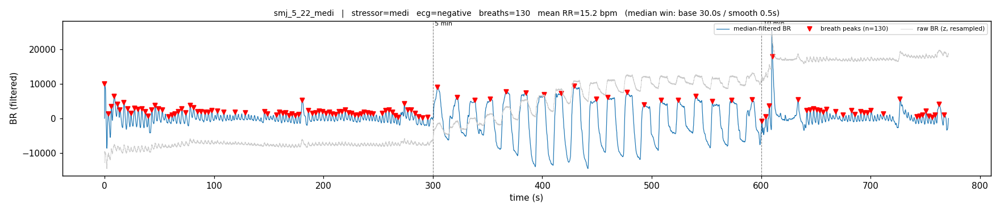

### Plank

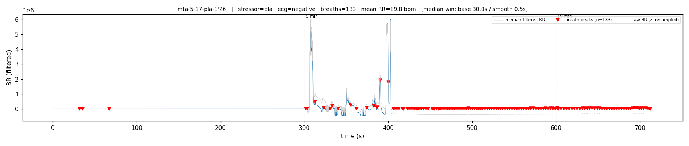
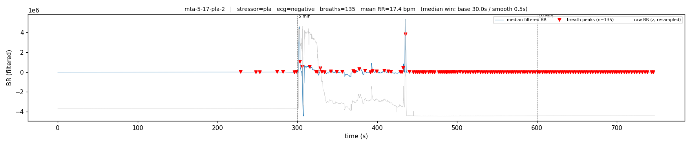
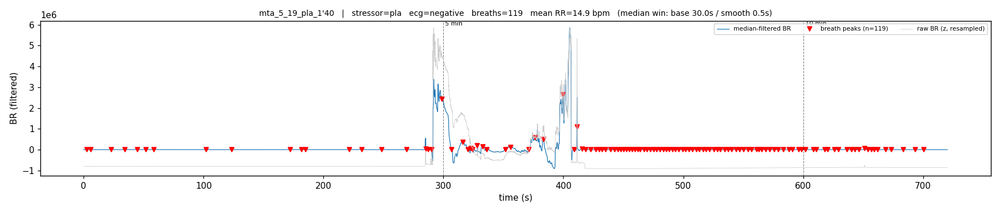
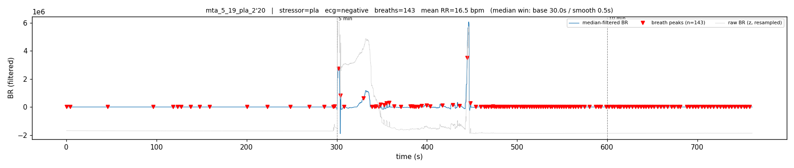
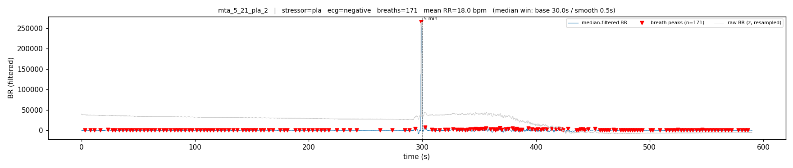
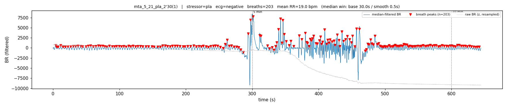
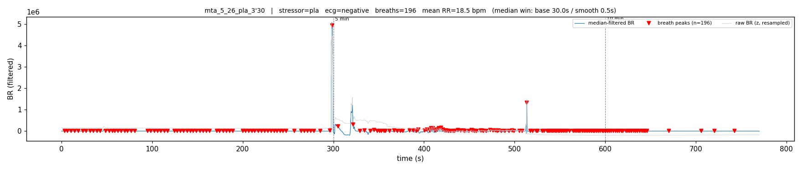
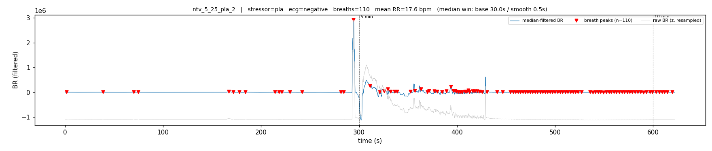
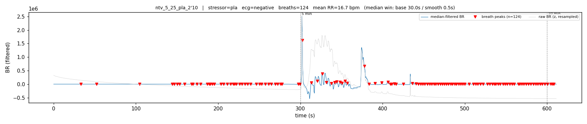
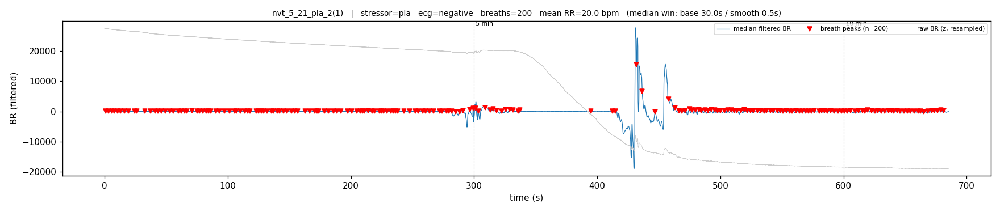
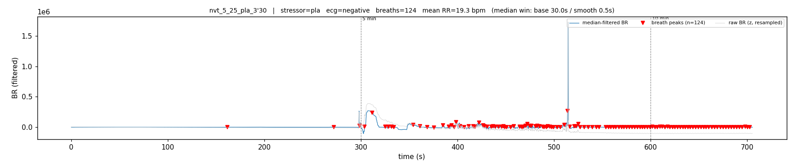
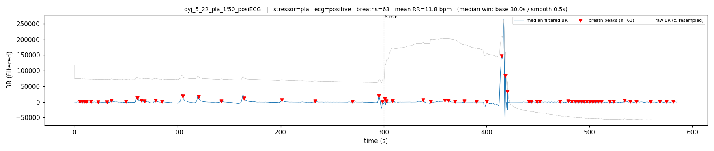
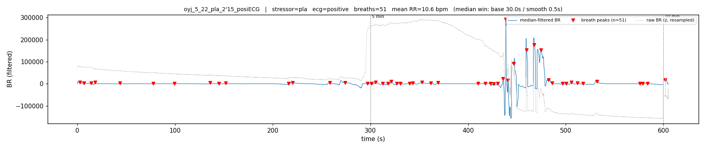
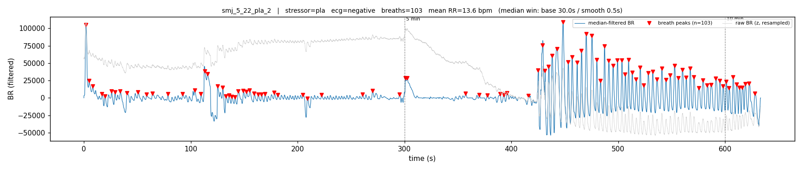
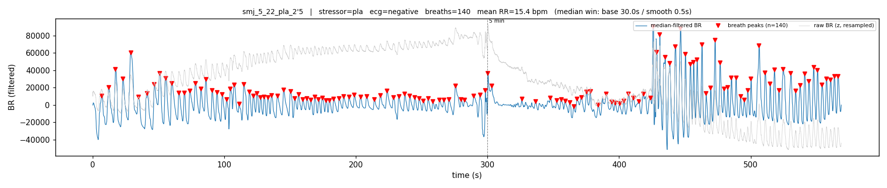

### Math

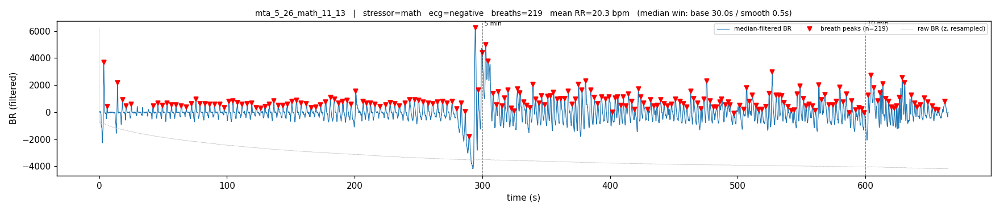
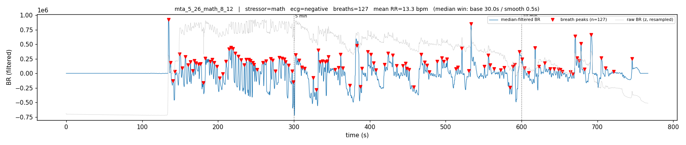
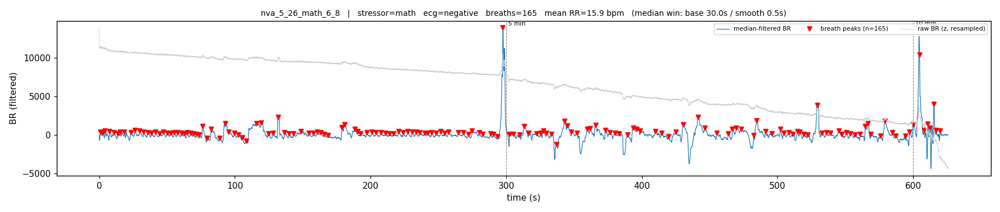
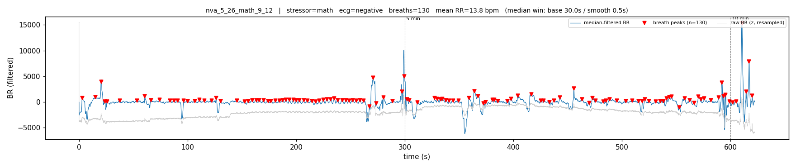
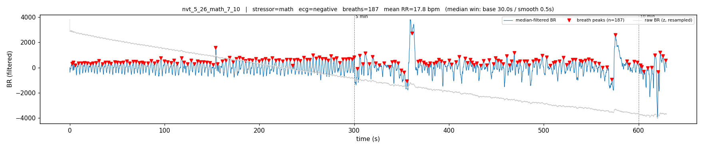
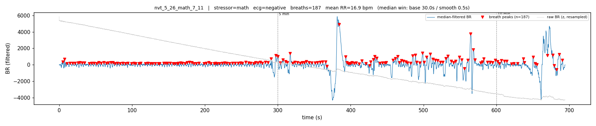

## 5. How to reproduce / retune

```bash
# Regenerate every BR peak plot + the per-recording index
uv run python scripts/plot_br_peaks.py
```

To retune the adaptable windows or the prominence floor, edit the defaults in
`src/preprocess.py` (`BR_BASELINE_WINDOW_S`, `BR_SMOOTH_WINDOW_S`, and
`detect_br_peaks(prom_frac=...)`) or pass them through — e.g. a longer
`smooth_window_s` for noisier belts, a higher `prom_frac` to be stricter about
what counts as a breath in low-SNR rest segments.

## 6. Open items

1. **Rest/recovery BR is low-SNR** for most recordings — the belt/mic couples well only during deep or labored breathing. If quiet-breathing rate matters for the downstream `rest` class, the sensor coupling during rest needs attention.
2. **`prom_frac` is a single global value.** A per-phase or locally-adaptive prominence would detect shallow rest breaths without admitting noise, at the cost of complexity. Deferred until rest-phase BR quality is confirmed.
3. The classification pipeline ([`report.md`](report.md)) still needs to be re-run on this refreshed 31-recording dataset with the `math` class added; that is tracked separately.
