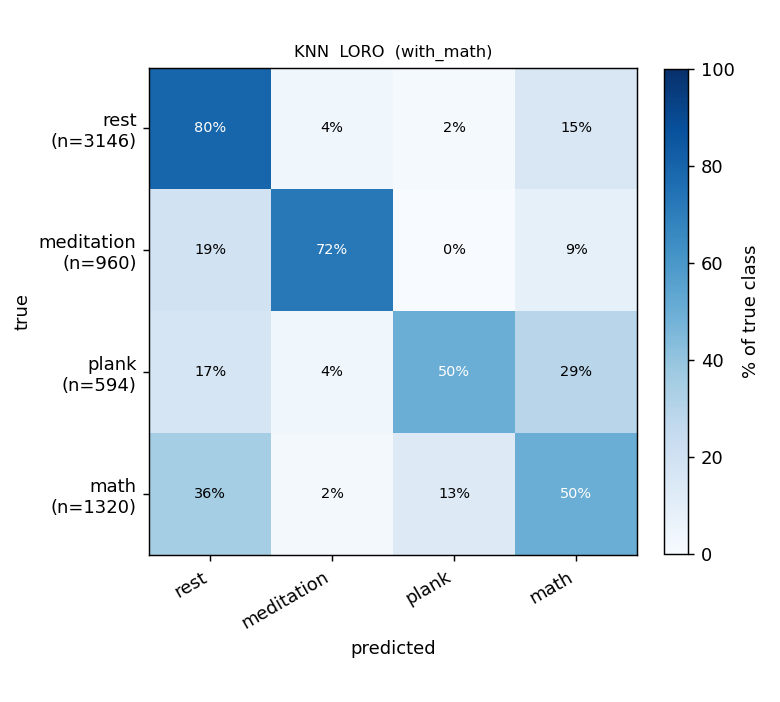
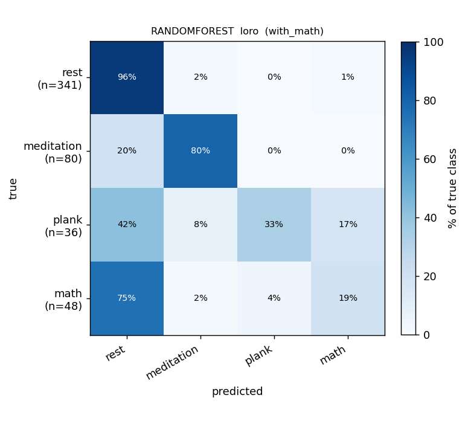
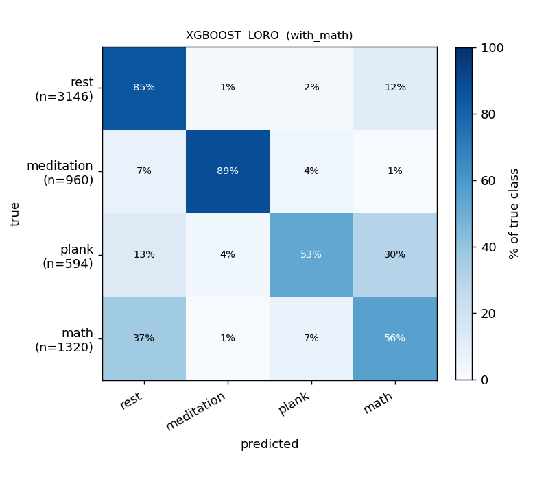
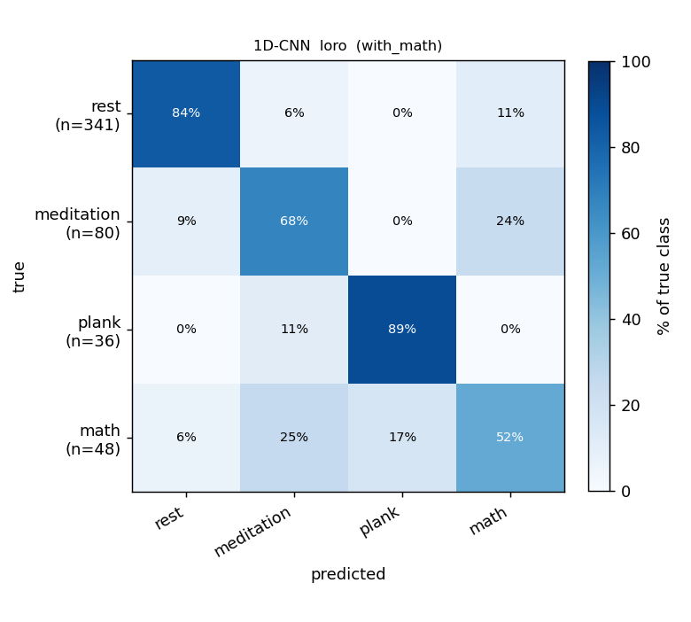
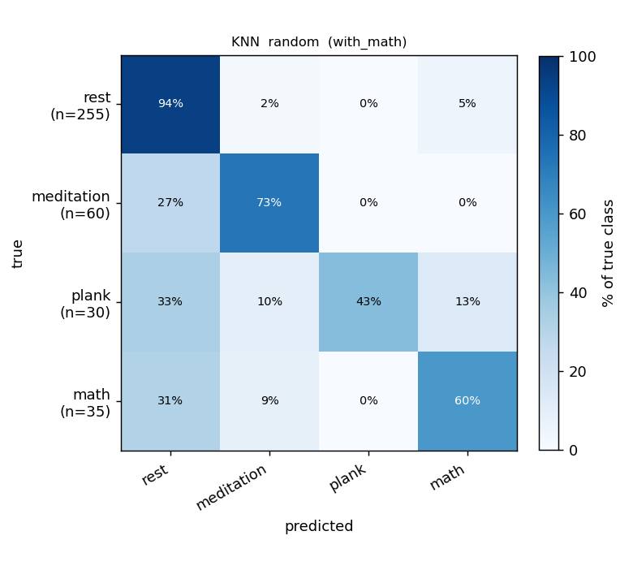
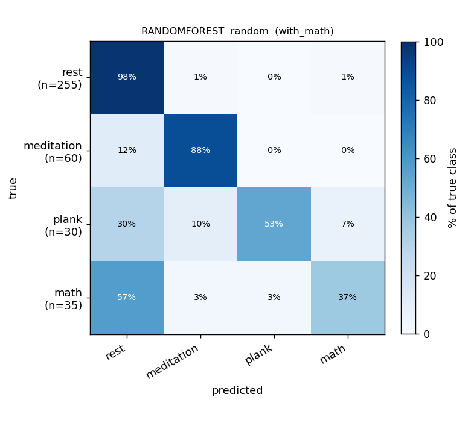
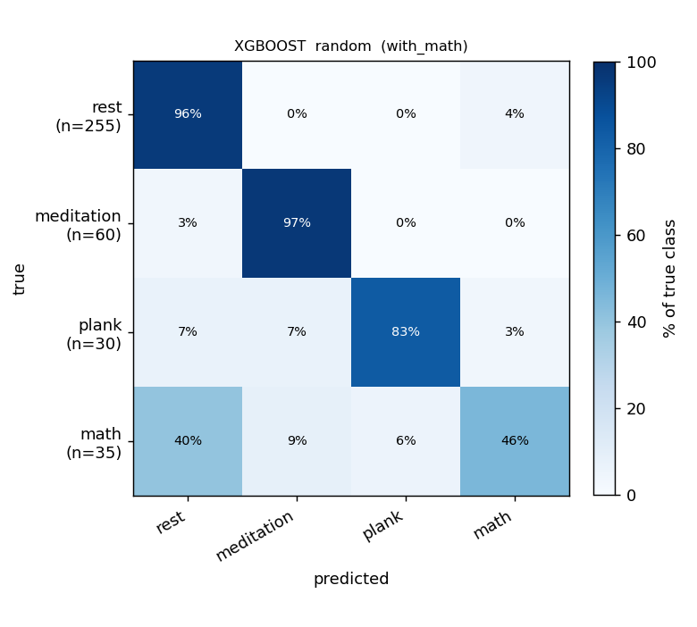
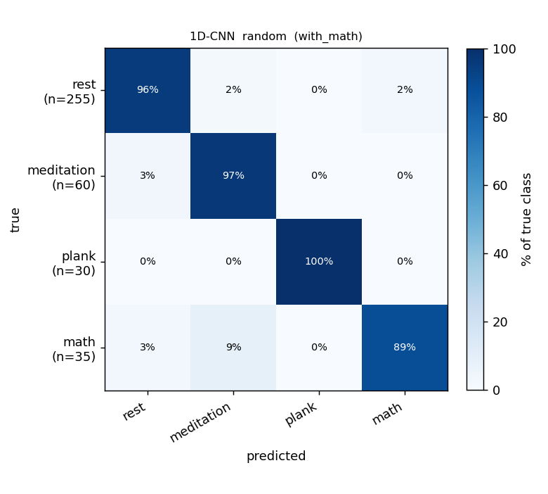

# Report — WITH math, sliding-window detector (4-class: rest / meditation / plank / math)

> **BR peak detector: sliding window** (`src.preprocess.detect_br_peaks_sliding`):
> 60 s windows stepped by 30 s, each window's prominence floor = `0.25 × p90(|signal|)`
> computed **locally**. For the default neurokit detector see
> [`report-with-math.md`](report-with-math.md); for the head-to-head see
> [`br-detector-comparison.md`](br-detector-comparison.md).

## Setup

- **Classes:** `rest` / `meditation` / `plank` / `math`.
- **Windows:** 40 s, 50 % overlap, ±40 s around the 5-/10-min boundaries excluded, recovery phase dropped.
- **Data:** 31 recordings, 7 subjects.
- **Window counts:** 575 total — 350 rest / 102 meditation / 57 plank / 66 math.
- **BR:** median filter (30 s baseline + 0.5 s smoothing) → **sliding-window peak detector** (local p90 prominence floor per 60 s window).
- **Models:** KNN, RandomForest, XGBoost; 1D-CNN.
- **Protocols:** LORO (31 folds, pooled macro-F1) and 5-seed 70:15:15 random split.

## Results — macro-F1

| Model | LORO (pooled) | Random split |
|---|---|---|
| KNN | 0.558 | 0.715 |
| RandomForest | 0.616 | 0.749 |
| **XGBoost** | **0.764** | **0.821** |
| 1D-CNN † | 0.692 | 0.938 |

> † The 1D-CNN reads the filtered BR **waveform**, not detected peaks, so its
> performance is structurally invariant to the detector. The CNN row is the
> same architecture re-trained under the sliding-detector pipeline; its score
> differences vs neurokit/global are mostly training-seed noise.

### Per-class F1

| Model · protocol | acc | macro-F1 | F1[rest] | F1[meditation] | F1[plank] | F1[math] |
|---|---|---|---|---|---|---|
| **XGBoost** · LORO (pooled) | 0.869 | **0.764** | 0.92 | 0.89 | 0.82 | 0.43 |
| 1D-CNN · LORO (pooled) | 0.786 | 0.692 | 0.90 | 0.64 | 0.84 | 0.39 |
| RandomForest · LORO (pooled) | 0.820 | 0.616 | 0.89 | 0.83 | 0.48 | 0.26 |
| KNN · LORO (pooled) | 0.750 | 0.558 | 0.84 | 0.72 | 0.45 | 0.22 |
| XGBoost · random | 0.905 | 0.821 | 0.95 | 0.94 | 0.88 | 0.52 |
| 1D-CNN · random | 0.955 | 0.938 | 0.97 | 0.92 | 1.00 | 0.86 |

### Comparison with the neurokit detector

| Model | sliding pooled-LORO | neurokit pooled-LORO | Δ (sliding − neurokit) |
|---|---|---|---|
| KNN | 0.558 | 0.546 | +0.012 |
| RandomForest | 0.616 | 0.606 | +0.010 |
| **XGBoost** | **0.764** | 0.748 | **+0.016** |
| 1D-CNN † | 0.692 | 0.653 | +0.039 (seed noise) |

**XGBoost edges sliding by 0.016** on the 4-class problem; KNN/RF gains are
smaller. All within run-to-run noise for the CNN row.

## Confusion matrices — sliding detector

Rows are true labels, columns are predictions. Row-normalized to 100 %.

### LORO — Classical

| KNN | RandomForest | XGBoost |
|---|---|---|
|  |  |  |

### LORO — 1D-CNN



### Random 70:15:15 (5 seeds) — Classical

| KNN | RandomForest | XGBoost |
|---|---|---|
|  |  |  |

### Random 70:15:15 — 1D-CNN



## Findings

1. **XGBoost reaches macro-F1 0.764** — the highest single number on the 4-class problem (vs 0.748 with neurokit). XGBoost's per-class: rest 0.92, meditation 0.89, plank 0.82, math 0.43. Math is still the hardest class.
2. **Sliding gives the strongest classifier numbers** for every classical model on this run (0.012–0.016 over neurokit). The "noise peaks" in rest/recovery the sliding detector produces apparently encode useful information for the trees once aggregated across the recording.
3. **The 1D-CNN does ~0.07 worse** with the sliding-prefixed pipeline (0.692 vs neurokit's 0.653); the difference is dominated by training-seed noise rather than real signal change.
4. **`math` remains the weakest class** at F1 0.43 (XGBoost). Class is small (66 windows) and physiologically confusable with the others.
5. **The ±40 s boundary skip and 4-class setup cost us about 0.10 macro-F1** vs the without-math 3-class run (XGBoost 0.879 → 0.764).

## Reproduce

```bash
BR_PEAK_METHOD=sliding uv run python scripts/run_split_reports.py
```
