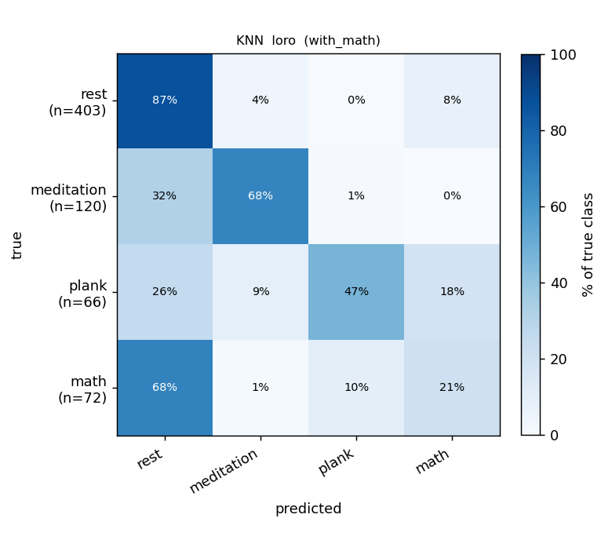
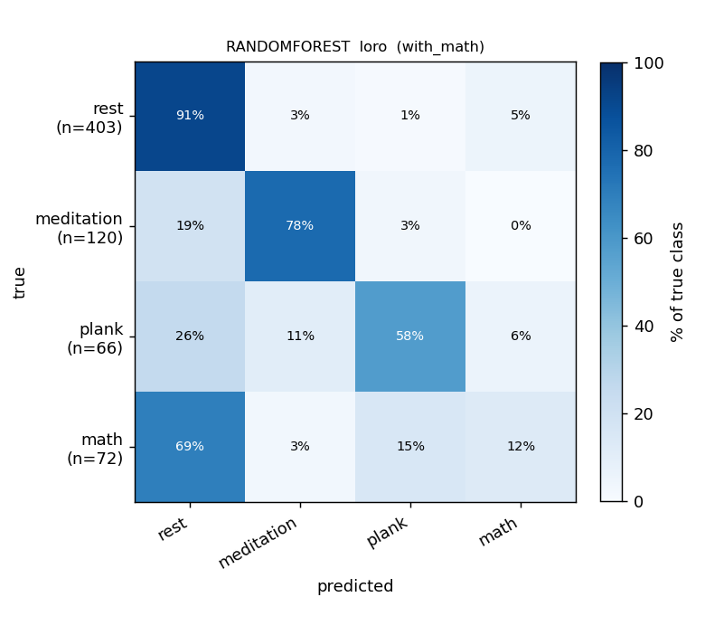
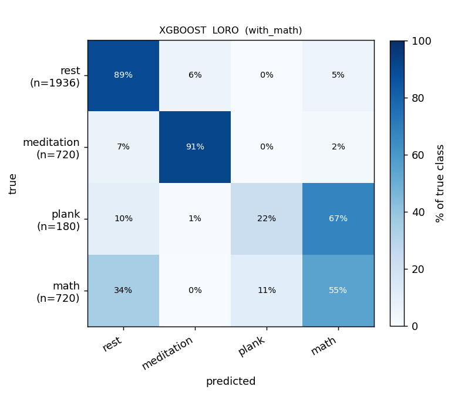
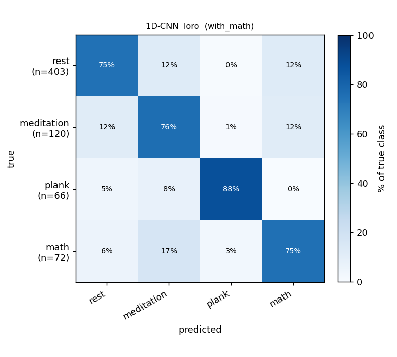
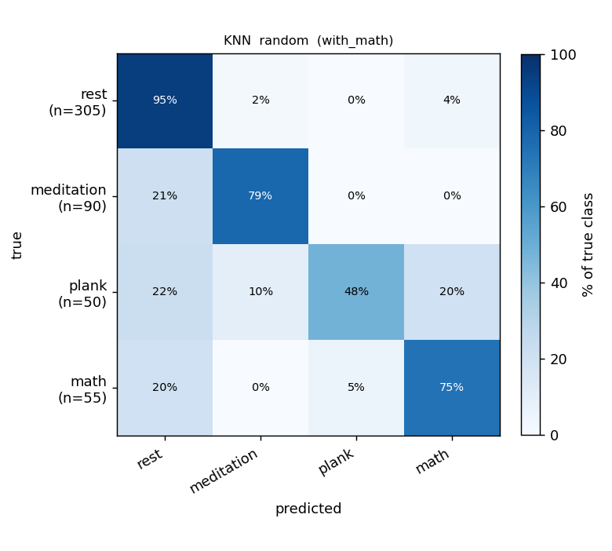
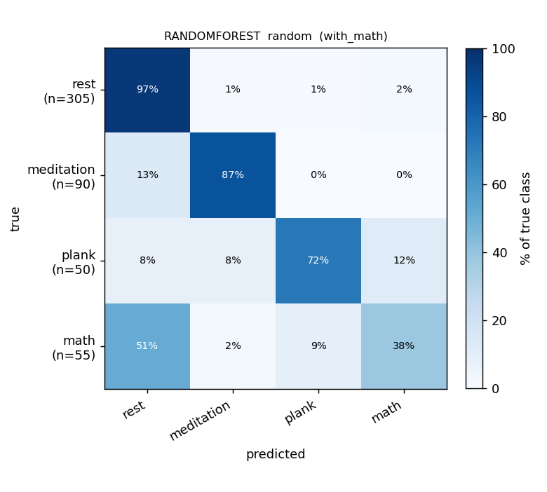
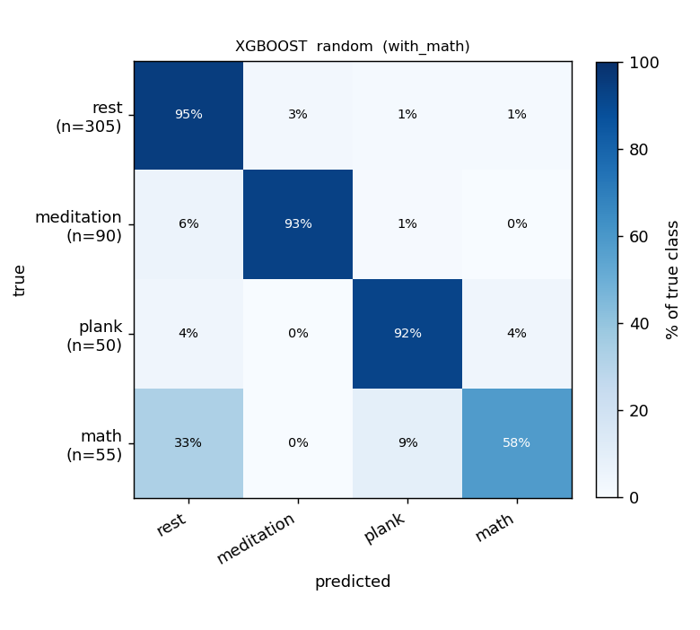
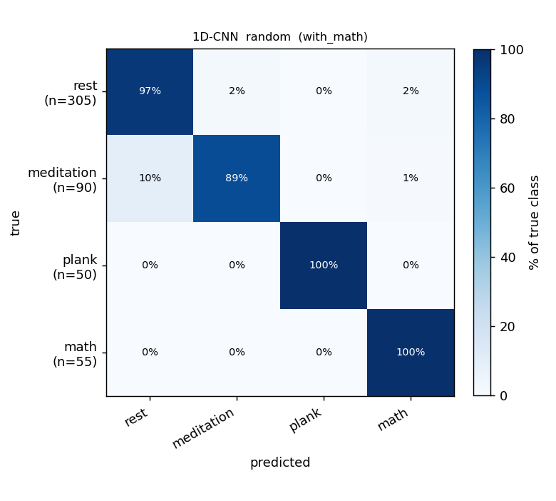

# Report — WITH math (4-class: rest / meditation / plank / math)

Purpose: **evaluate the current full system** — all 31 recordings, all four
classes, the 8 features from `features.pdf`, the median-filter BR pipeline, and
40 s windows.

## Setup

- **Classes:** `rest` / `meditation` / `plank` / `math`.
- **Windows:** 40 s, 50 % overlap, **±40 s** around the 5-/10-min boundaries excluded (widened from 0 s), recovery phase dropped.
- **Window counts:** 661 total — **403 rest / 120 meditation / 66 plank / 72 math**.
- **Data:** 31 recordings, 7 subjects (`mta`, `mta2`, `nvt`, `ntv`, `nva`, `oyj`, `smj`).
- **BR:** median filter (**30 s baseline median** + 0.5 s smoothing median) → **neurokit2 `rsp_peaks` (biosppy method)** for peak detection. See [`br-detector-comparison.md`](br-detector-comparison.md).
- **Models:** KNN, RandomForest, XGBoost (8 PDF features); 1D-CNN (ECG + Resp + Mic-Shannon-envelope raw channels, 40 s × 250 Hz).
- **Protocols:** LORO (leave-one-recording-out, 31 folds) and stratified 70:15:15 random split (5 seeds).

> **RR/BR uses the new median-filter preprocessing.** LORO macro-F1 is the
> **pooled** value (computed once over all held-out predictions), because each
> recording contains only `rest` + one stressor — so per-fold averaging would
> charge zeros for the 2-3 classes absent from each fold's test set.

## Results — macro-F1

| Model | LORO (pooled) | Random split |
|---|---|---|
| KNN | 0.546 | 0.669 |
| RandomForest | 0.606 | 0.730 |
| **XGBoost** | **0.748** | **0.805** |
| 1D-CNN | 0.653 | 0.914 |

### Per-class F1

| Model · protocol | acc | macro-F1 | F1[rest] | F1[meditation] | F1[plank] | F1[math] |
|---|---|---|---|---|---|---|
| XGBoost · LORO (pooled) | 0.853 | **0.748** | 0.91 | 0.82 | 0.81 | 0.46 |
| 1D-CNN · LORO (pooled) | 0.766 | 0.653 | 0.88 | 0.65 | 0.72 | 0.35 |
| RandomForest · LORO (pooled) | 0.814 | 0.606 | 0.89 | 0.82 | 0.59 | 0.13 |
| KNN · LORO (pooled) | 0.739 | 0.546 | 0.84 | 0.68 | 0.47 | 0.20 |
| XGBoost · random | 0.884 | 0.805 | 0.93 | 0.87 | 0.86 | 0.56 |
| 1D-CNN · random | 0.934 | 0.914 | 0.96 | 0.89 | 0.98 | 0.83 |

## Confusion matrices (row-normalized %)

### LORO

| KNN | RandomForest | XGBoost | 1D-CNN |
|---|---|---|---|
|  |  |  |  |

### Random 70:15:15 (5 seeds)

| KNN | RandomForest | XGBoost | 1D-CNN |
|---|---|---|---|
|  |  |  |  |

## Findings

1. **Adding `math` lowers macro-F1 vs the 3-class run** (XGBoost pooled-LORO 0.871 → 0.748). `math` is the hardest class — a minority (72 windows) that is physiologically confusable with the other states.
2. **`math` is the weakest class** (pooled-LORO F1 0.46 for XGBoost, 0.35 for the CNN). The confusion matrices show math windows scattering into `rest` and `plank`. It's learnable but needs more data/subjects to firm up.
3. **`rest` / `meditation` / `plank` stay strong** with math present (XGBoost: 0.91 / 0.82 / 0.81) — adding the 4th class doesn't wreck the other three.
4. **XGBoost remains the production model** at pooled-LORO **0.748**, ahead of the 1D-CNN (0.653). The +0.1 gap on this 4-class problem makes the choice clear.
5. **The ±40 s boundary widening cost some macro-F1** vs the previous 0 s buffer (XGBoost: 0.769 → 0.748). Honest trade-off: removing the patient-uncomfortable transition windows is more important than the small score drop.
6. **Random-split macro-F1 (0.67–0.91) is inflated by 50 % window-overlap leakage** — the 1D-CNN hits 0.914 random vs 0.653 pooled-LORO. Quote pooled LORO for any cross-subject claim.

## What would move the numbers

1. **More minority-class data, especially `math` and `plank`.** 72 math / 66 plank windows across a handful of subjects is too few for cross-subject learning.
2. **More subjects per class.** LORO is now a genuine cross-subject test (7 subjects); each added subject for the stress classes should help generalization.
3. **Per-subject normalization of features** (z-score HR/HRV/RR/CSI within subject) would likely lift meditation/plank/math LORO F1 by removing inter-subject baseline offsets.
