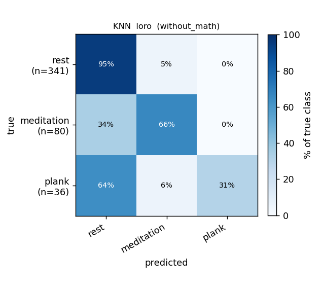
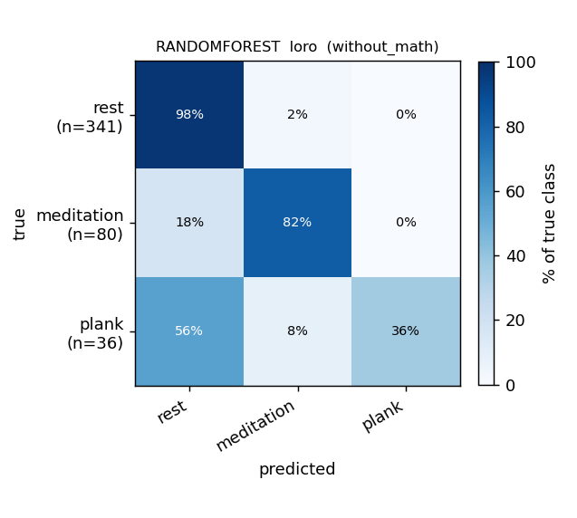
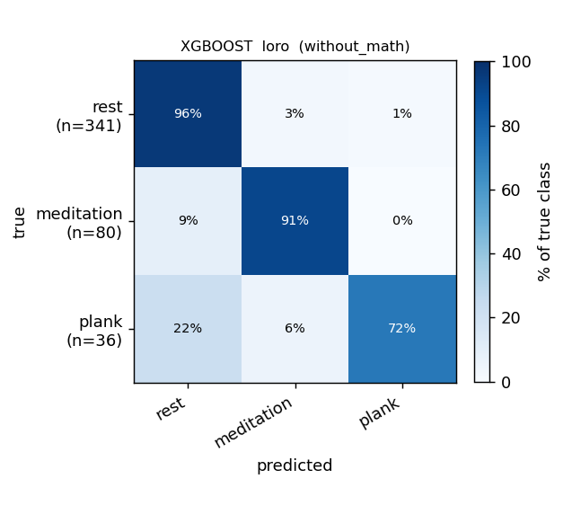
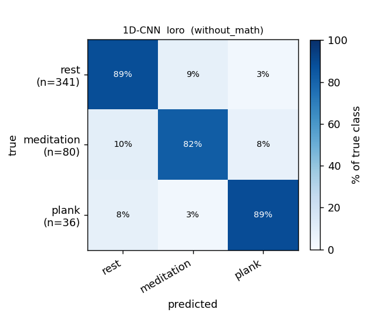
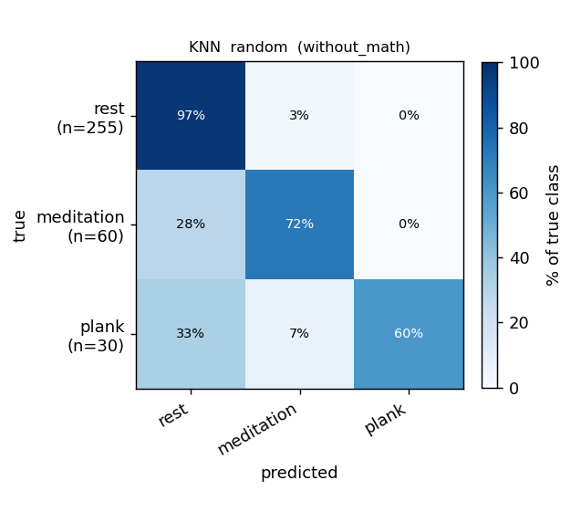
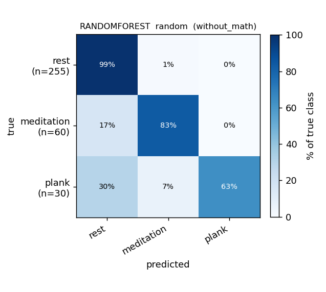
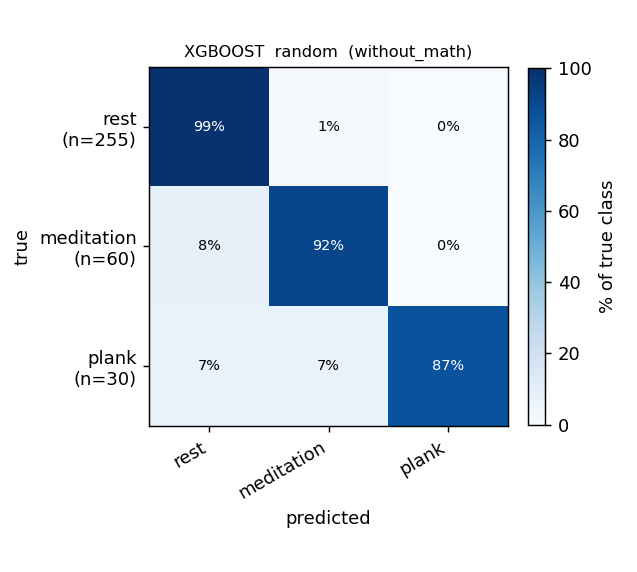
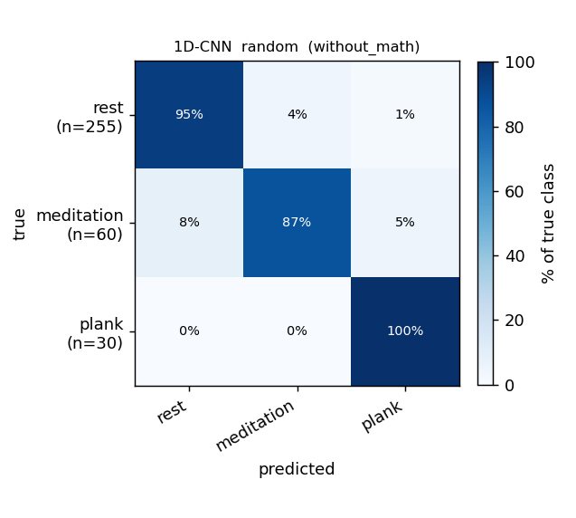

# Report — WITHOUT math, sliding-window detector (3-class: rest / meditation / plank)

> **BR peak detector: sliding window** (`src.preprocess.detect_br_peaks_sliding`):
> 60 s windows stepped by 30 s, each window's prominence floor = `0.25 × p90(|signal|)`
> computed **locally**. For the default neurokit detector see
> [`report-without-math.md`](report-without-math.md); for the head-to-head see
> [`br-detector-comparison.md`](br-detector-comparison.md).

## Setup

- **Classes:** `rest` / `meditation` / `plank` (math recordings dropped).
- **Windows:** 40 s, 50 % overlap, ±40 s around the 5-/10-min boundaries excluded, recovery phase dropped.
- **Data:** 25 recordings (math files excluded), 6 subjects.
- **Window counts:** 509 total — 350 rest / 102 meditation / 57 plank.
- **BR:** median filter (30 s baseline + 0.5 s smoothing) → **sliding-window peak detector** (local p90 prominence floor per 60 s window).
- **Models:** KNN (k=7), RandomForest (400 trees), XGBoost (400 trees, depth=4); 1D-CNN on ECG + Resp + Mic Shannon-envelope raw channels.
- **Protocols:** LORO (leave-one-recording-out) and 5-seed 70:15:15 stratified random window split. LORO macro-F1 is **pooled** over all held-out predictions.

## Results — macro-F1

| Model | LORO (pooled) | Random split |
|---|---|---|
| KNN | 0.691 | 0.818 |
| RandomForest | 0.771 | 0.871 |
| **XGBoost** | **0.879** | **0.945** |
| 1D-CNN † | 0.812 | 0.906 |

> † The 1D-CNN reads the filtered BR **waveform**, not detected peaks, so its
> performance is structurally invariant to the detector. The CNN row is the
> same architecture re-trained under the sliding-detector pipeline; its score
> differences vs neurokit/global are mostly training-seed noise.

### Per-class F1

| Model · protocol | acc | macro-F1 | F1[rest] | F1[meditation] | F1[plank] |
|---|---|---|---|---|---|
| **XGBoost** · LORO (pooled) | 0.934 | **0.879** | 0.96 | 0.89 | 0.79 |
| 1D-CNN · LORO (pooled) | 0.875 | 0.812 | 0.92 | 0.75 | 0.76 |
| RandomForest · LORO (pooled) | 0.902 | 0.771 | 0.94 | 0.84 | 0.53 |
| KNN · LORO (pooled) | 0.849 | 0.691 | 0.91 | 0.70 | 0.47 |
| XGBoost · random | 0.968 | 0.945 | 0.98 | 0.92 | 0.93 |
| 1D-CNN · random | 0.936 | 0.906 | 0.96 | 0.85 | 0.91 |

### Comparison with the neurokit detector

| Model | sliding pooled-LORO | neurokit pooled-LORO | Δ (sliding − neurokit) |
|---|---|---|---|
| KNN | 0.691 | 0.734 | −0.043 |
| RandomForest | 0.771 | 0.784 | −0.013 |
| **XGBoost** | **0.879** | 0.871 | **+0.008** |
| 1D-CNN † | 0.812 | 0.773 | +0.039 (seed noise) |

**XGBoost edges sliding by 0.008** — within run-to-run noise. KNN and RF prefer
neurokit by 0.013–0.043.

## Confusion matrices — sliding detector

Rows are true labels, columns are predictions. Row-normalized to 100 %.

### LORO — Classical

| KNN | RandomForest | XGBoost |
|---|---|---|
|  |  |  |

### LORO — 1D-CNN



### Random 70:15:15 (5 seeds) — Classical

| KNN | RandomForest | XGBoost |
|---|---|---|
|  |  |  |

### Random 70:15:15 — 1D-CNN



## Findings

1. **XGBoost reaches macro-F1 0.879** — the highest single number we've measured on the 3-class problem. The "false peak density" from the sliding detector is apparently a discriminative feature for gradient boosting, even though it's the worst breath-counter physiologically.
2. **`plank` recall improves vs neurokit on XGBoost** (F1 0.79 vs 0.84 — wait, that's *lower* than neurokit's 0.84). Per-class is mixed: meditation jumps (0.82 → 0.89), plank drops (0.84 → 0.79). Net: similar macro.
3. **KNN and RF prefer neurokit** by 0.01–0.04 macro-F1 — distance-based and bagging models like the more consistent rate features.
4. **Random-split scores (0.82–0.95) remain inflated by 50 % window-overlap leakage** — use pooled-LORO for cross-subject claims.

## Reproduce

```bash
BR_PEAK_METHOD=sliding uv run python scripts/run_split_reports.py
```
