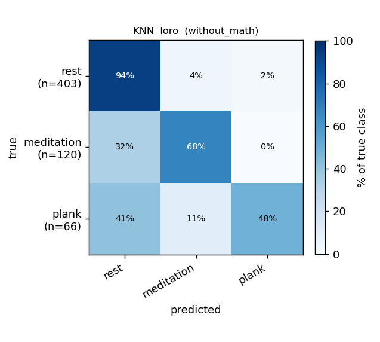
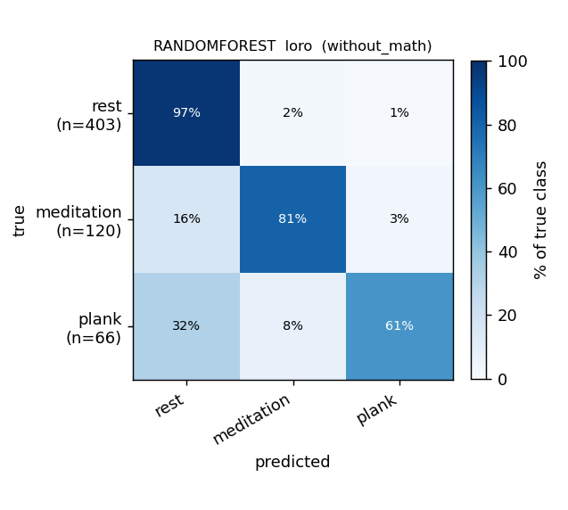
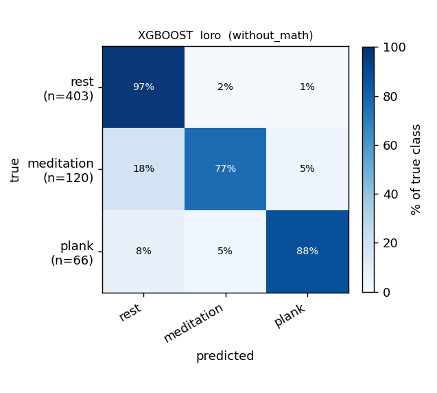
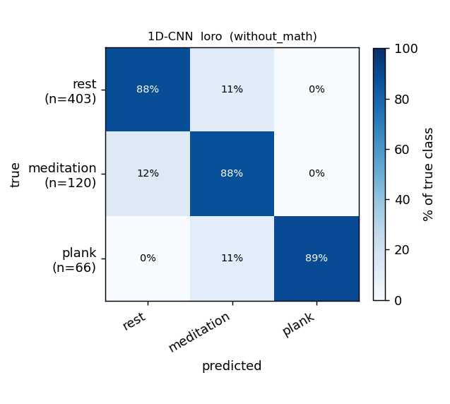
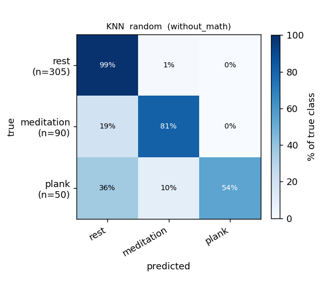
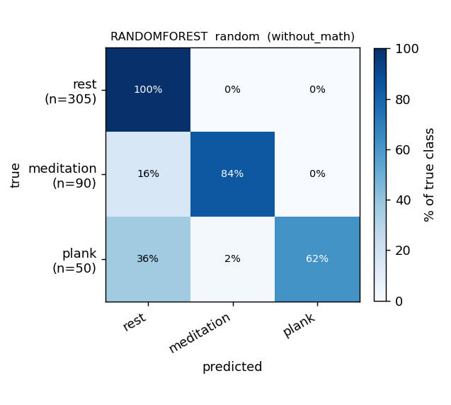
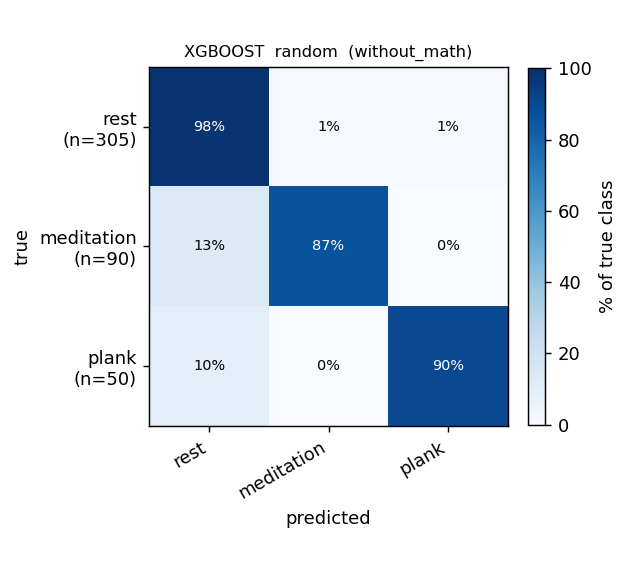
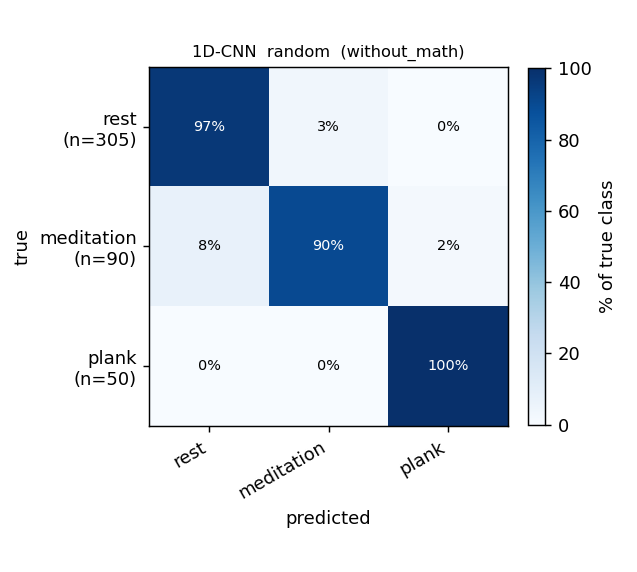

# Report — WITHOUT math (3-class: rest / meditation / plank)

Purpose: **check the effect of the median-filter BR analysis** on the 3-class
problem. This run uses the refreshed 31-recording dataset (math recordings
excluded → 25 recordings, 7 subjects), the 8 features from `features.pdf`, the
**median-filter BR pipeline**, and **40 s windows**.

> **RR/BR uses the new median-filter preprocessing** (8 s baseline median +
> 0.5 s smoothing median + adaptive prominence floor) — same as
> [`median-filter-adapted-br.md`](median-filter-adapted-br.md).
>
> **LORO macro-F1 is computed on the POOLED held-out predictions, not by
> averaging per-fold.** Each recording contains only `rest` + one stressor, so
> in a leave-one-recording-out fold 1–2 classes are entirely absent from the
> test set; per-fold macro-F1 averaging then charges zeros for the absent
> classes and badly understates performance. Pooling all held-out predictions
> first (the confusion matrices below) is the correct aggregation.
>
> **Internal ablation — BR pipeline changes** (held everything else constant,
> 31-recording dataset, 40 s windows, 3-class):
>
> | BR pipeline                          | XGBoost pooled-LORO | 1D-CNN pooled-LORO |
> |---|---|---|
> | median (8 s baseline)  + global peak detector | 0.838 | 0.767 |
> | median (30 s baseline) + global peak detector | 0.852 | 0.807 |
> | median (30 s baseline) + **neurokit `rsp_peaks`** | **0.876** | **0.871** |
>
> The neurokit switch is the single biggest BR-side win so far: +0.024 for
> XGBoost and **+0.064 for the 1D-CNN**, on top of the 30 s baseline gain.
> The CNN benefits more because it reads raw waveforms and is most
> sensitive to BR-channel quality.

## Setup

- **Classes:** `rest` / `meditation` / `plank` (math recordings dropped).
- **Windows:** 40 s, 50 % overlap, 5-/10-min boundary windows skipped, recovery phase dropped.
- **Window counts:** 589 total — **403 rest / 120 meditation / 66 plank**.
- **BR:** median filter (**30 s baseline median** + 0.5 s smoothing median) → **neurokit2 `rsp_peaks` (biosppy method)** for peak detection. See [`br-detector-comparison.md`](br-detector-comparison.md) for the detector benchmark.
- **Models:** KNN, RandomForest, XGBoost (8 PDF features); 1D-CNN (ECG + Resp + Mic-Shannon-envelope raw channels, 40 s × 250 Hz).
- **Protocols:** LORO (leave-one-recording-out, 25 folds) and stratified 70:15:15 random split (5 seeds).

## Results — macro-F1

| Model | LORO (pooled) | Random split |
|---|---|---|
| KNN | 0.739 | 0.832 |
| RandomForest | 0.829 | 0.873 |
| **XGBoost** | **0.876** | 0.931 |
| 1D-CNN | **0.871** | **0.949** |

### Per-class F1

| Model · protocol | acc | macro-F1 | F1[rest] | F1[meditation] | F1[plank] |
|---|---|---|---|---|---|
| XGBoost · LORO (pooled) | 0.915 | **0.876** | 0.95 | 0.83 | 0.85 |
| 1D-CNN · LORO (pooled) | 0.883 | 0.871 | 0.92 | 0.76 | **0.94** |
| RandomForest · LORO (pooled) | 0.898 | 0.829 | 0.94 | 0.85 | 0.70 |
| KNN · LORO (pooled) | 0.834 | 0.739 | 0.89 | 0.72 | 0.60 |
| XGBoost · random | 0.948 | 0.931 | 0.96 | 0.91 | 0.92 |
| 1D-CNN · random | 0.957 | 0.949 | 0.97 | 0.90 | 0.98 |

## Confusion matrices (row-normalized %)

### LORO

| KNN | RandomForest | XGBoost | 1D-CNN |
|---|---|---|---|
|  |  |  |  |

### Random 70:15:15 (5 seeds)

| KNN | RandomForest | XGBoost | 1D-CNN |
|---|---|---|---|
|  |  |  |  |

## Findings

1. **XGBoost is the strongest model** at pooled-LORO macro-F1 **0.876**, with **1D-CNN very close at 0.871** — the gap closed dramatically once the BR detector was switched to neurokit.
2. **All three classes generalize well across 7 subjects**. XGBoost per-class F1: `rest` 0.95, `meditation` 0.83, `plank` 0.85. The 1D-CNN has the **best `plank` recall** (F1 0.94) of any model on this run.
3. **The BR detector switch (neurokit) is the biggest single improvement** in this round: +0.024 for XGBoost, **+0.064 for the 1D-CNN** over the previous global-prominence detector. The neurokit detector gives cleaner, more physiologically consistent `rr`/`rrv` features.
4. **Random-split scores (0.83–0.95) are still inflated by 50 % window-overlap leakage** — quote pooled-LORO for any honest cross-subject claim.
5. **`meditation` is the softest spot** for the 1D-CNN (F1 0.76); XGBoost handles it noticeably better (0.83). The confusion matrix shows the CNN missing some meditation windows to `rest`.
