# Stress / Meditation / Baseline Classification Report

**Task.** Per-window 3-class classification: `baseline` / `meditation` / `stress`.
**Data.** Local wearable recordings only (7 sessions, 2 subjects). WESAD is excluded from this report.
**Feature pipeline.** The eight parameters defined in [`features.pdf`](features.pdf), with a separate temperature ablation.
**Evaluation protocols.** (a) Leave-one-recording-out (LORO, 7 folds) — the honest cross-recording benchmark; (b) stratified 70:15:15 random window split averaged over 5 seeds — useful as a sanity check but contaminated by 50 % window overlap.

---

## 1. Feature definitions (from features.pdf)

Exactly eight features per 60 s window — no others.

| Feature | Channel | Preprocessing | Computation |
|---|---|---|---|
| `csi` | Microphone | Bandpass 20–200 Hz → Shannon-energy envelope `−x² log(x²)` → peak detection in the envelope | S2/S1 amplitude ratio. Each ECG R-peak picks one S1 (Shannon peak in R+0–200 ms) and one S2 (Shannon peak in R+200–500 ms). CSI = mean(S2 amp) / mean(S1 amp) over the window. |
| `hr` | ECG | Low-pass 150 Hz + detrend → Pan–Tompkins R-peak detection. NN intervals cleaned: reject NN < 300 ms, NN > 1500 ms, or NN deviating > 20 % from the median of the surrounding ~10 beats. Rejected NNs are cubic-spline interpolated. | `60 000 / mean(NN_ms)` (beats per minute) |
| `hrv_rmssd` | ECG | Same cleaned NN series | `√(mean((NN_{i+1} − NN_i)²))` over the window, in ms |
| `hrv_lf` | ECG | Welch PSD on a 4 Hz interpolated tachogram, Hann window, 60 s segments where possible | Area under PSD in 0.04–0.15 Hz, in ms² |
| `hrv_hf` | ECG | Same Welch PSD | Area under PSD in 0.15–0.40 Hz, in ms² |
| `hrv_lf_hf` | ECG | — | `hrv_lf / hrv_hf` |
| `rr` | Respiration | Detrend → 0.5 s moving average → 4th-order Chebyshev II low-pass (stopband edge 1 Hz, 40 dB attenuation) → 2nd-order Butterworth high-pass at 0.12 Hz. Slope-based peak detection with adaptive threshold = 1/3 × mean amplitude of the last 8 accepted breaths. | `60 / mean(breath interval, s)` (breaths per minute) |
| `rrv` | Respiration | Same chain | Standard deviation of the last 5 breath intervals (s) |

### Optional temperature ablation (NOT in the PDF)

Three additional features are reported only for the explicit "with temperature vs without" comparison.

| Feature | Channel | Computation |
|---|---|---|
| `temp_mean_C` | Skin temperature | Mean of raw temperature samples in the window |
| `temp_std_C` | Skin temperature | Standard deviation in the window |
| `temp_slope_Cps` | Skin temperature | Linear-fit slope over the window (°C per second) |

**Window length: 60 s** (required by the PDF's "≥ 1 min for Welch" rule).
**Overlap: 50 %**.
**Total: 180 windows** across 7 recordings (105 baseline / 65 meditation / 4 stress).

---

## 2. Dataset summary

| Recording | baseline | meditation | stress |
|---|---|---|---|
| `mta-5-17-medi` | 14 | 13 | 0 |
| `mta-5-17-medi (1)` | 13 | 14 | 0 |
| **`mta-5-17-pla-1`** | 18 | 0 | **2** |
| **`mta-5-17-pla-2`** | 19 | 0 | **2** |
| `mta-5-8-medi` | 14 | 12 | 0 |
| `nvt-5-15-medi` | 13 | 13 | 0 |
| `nvt-5-8-medi` | 14 | 13 | 0 |
| **Total** | **105** | **65** | **4** |

Only two recordings (`pla-1`, `pla-2`) contain any `stress` windows, and they together contribute only 4 of the 180 windows (2.2 %). This is the main constraint on every model's `stress` F1.

---

## 3. Models

| Family | Inputs | Architecture |
|---|---|---|
| KNN | 8 PDF features (+3 temperature features for the ablation) | median-imputer → StandardScaler → KNN (k=7, distance-weighted, Euclidean) |
| RandomForest | same | median-imputer → RandomForest (400 trees, `min_samples_leaf=2`, `max_features='sqrt'`) |
| XGBoost | same | XGBoost (400 trees, depth=4, lr=0.05) — handles NaNs natively |
| 1D-CNN | 3 raw channels (ECG @ 250 Hz, Resp @ 250 Hz, Mic Shannon-envelope @ 250 Hz) over 60 s = (3, 15 000); +1 temperature channel for the ablation | 5-block 1D conv stack + AdaptiveAvgPool + 2-layer MLP head, 636 k params, AMP, AdamW + cosine LR, class-weighted CE, early stopping |

---

## 4. Results

### 4.1 LORO macro-F1 (mean across 7 folds)

| Model | PDF features only | + temperature | Δ |
|---|---|---|---|
| KNN | 0.686 | 0.623 | −0.063 |
| RandomForest | 0.764 | 0.747 | −0.018 |
| **XGBoost** | **0.825** | 0.792 | −0.033 |
| 1D-CNN | 0.349 | **0.611** | **+0.262** |

### 4.2 Random 70:15:15 macro-F1 (mean ± std over seeds 0–4)

| Model | PDF features only | + temperature |
|---|---|---|
| KNN | 0.748 ± 0.120 | 0.710 ± 0.102 |
| RandomForest | 0.817 ± 0.150 | 0.817 ± 0.150 |
| **XGBoost** | **0.838 ± 0.131** | 0.823 ± 0.132 |
| 1D-CNN | 0.799 ± 0.174 | 0.754 ± 0.156 |

### 4.3 LORO vs random-split — same models, different protocol

| Model | LORO | Random-split | Δ |
|---|---|---|---|
| KNN | 0.686 | 0.748 | +0.06 |
| RandomForest | 0.764 | 0.817 | +0.05 |
| XGBoost | 0.825 | 0.838 | +0.01 |
| **1D-CNN** | **0.349** | **0.799** | **+0.45** |

> ⚠️ **The CNN's huge jump under random split is leakage, not learning.** Windows have 50 % overlap, so a test window's 30-s-shifted neighbour can sit in the train set. Classical models work on scalar HRV summaries that are insensitive to that overlap; the CNN reads raw waveforms and latches onto the temporal proximity. **Use LORO numbers for any honest cross-recording claim; treat random-split numbers as a within-recording sanity check at most.**

### 4.4 Per-class F1 (LORO mean)

| Configuration | baseline | meditation | stress |
|---|---|---|---|
| KNN, PDF | 0.903 | 0.556 | 0.000 |
| KNN, +temp | 0.892 | 0.441 | 0.000 |
| RF, PDF | 0.934 | 0.595 | 0.000 |
| RF, +temp | 0.922 | 0.571 | 0.000 |
| XGBoost, PDF | 0.930 | 0.577 | **0.143** |
| XGBoost, +temp | 0.947 | 0.636 | 0.000 |
| 1D-CNN, PDF | 0.648 | 0.292 | 0.000 |
| 1D-CNN, +temp | 0.856 | 0.494 | **0.114** |

---

## 5. Confusion matrices

Rows are true labels, columns are predictions. All matrices sum across folds (LORO: 7 folds, ~180 test predictions) or across seeds (random-split: 5 seeds × 27 = 135 test predictions). Diagonal cells = correct; off-diagonal cells = errors.

### 5.1 LORO — Classical (PDF features only)

| KNN | RandomForest | XGBoost |
|---|---|---|
| 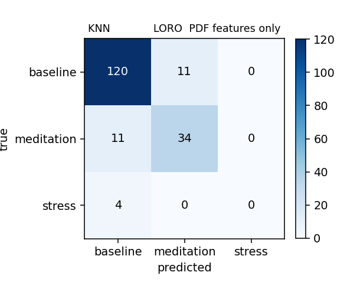 |  | 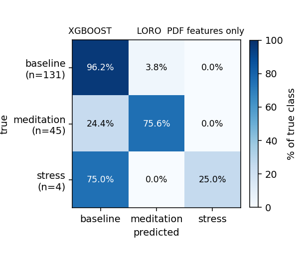 |

### 5.2 LORO — Classical (PDF + temperature)

| KNN | RandomForest | XGBoost |
|---|---|---|
| 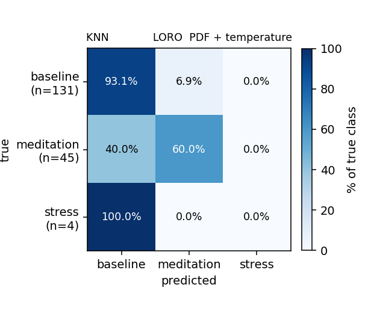 | 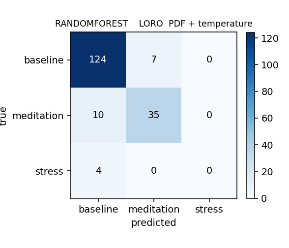 |  |

### 5.3 LORO — 1D-CNN

| PDF channels (3 ch) | + temperature (4 ch) |
|---|---|
| 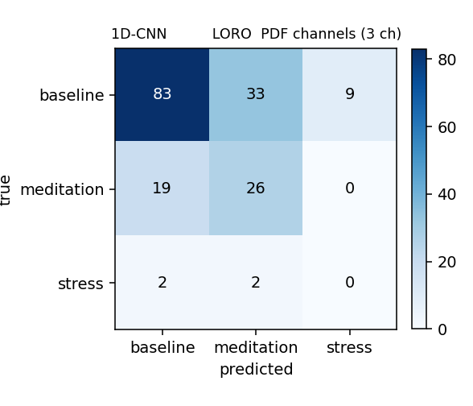 | 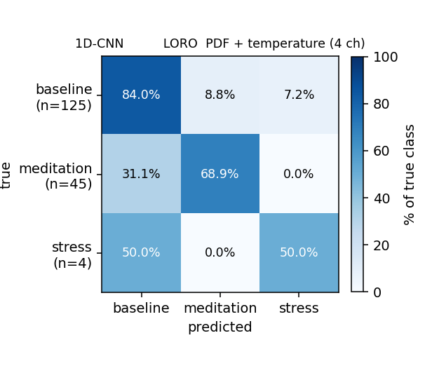 |

### 5.4 Random 70:15:15 — Classical (PDF features only)

| KNN | RandomForest | XGBoost |
|---|---|---|
| 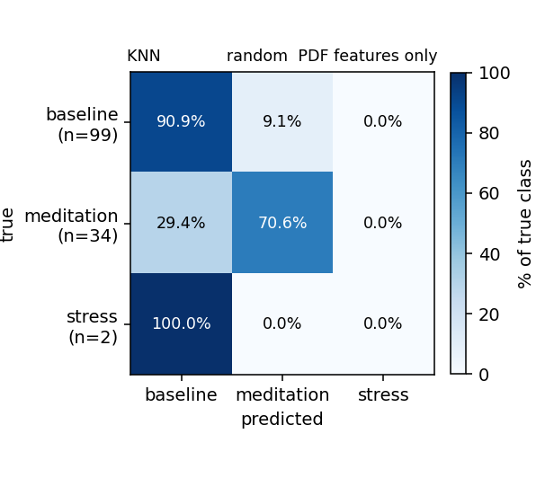 |  |  |

### 5.5 Random 70:15:15 — Classical (PDF + temperature)

| KNN | RandomForest | XGBoost |
|---|---|---|
| 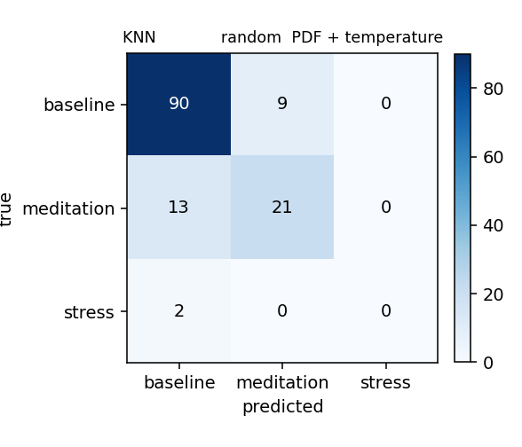 | 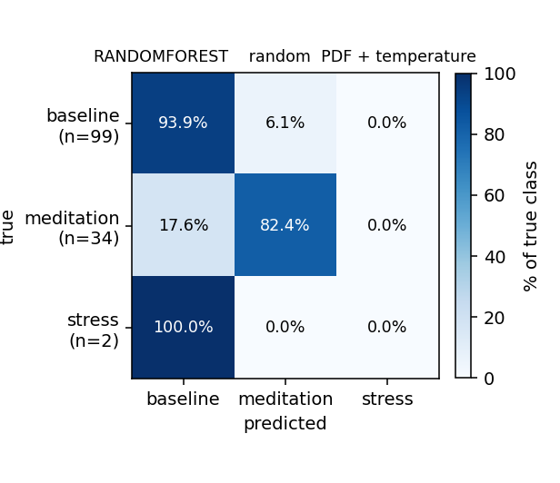 | 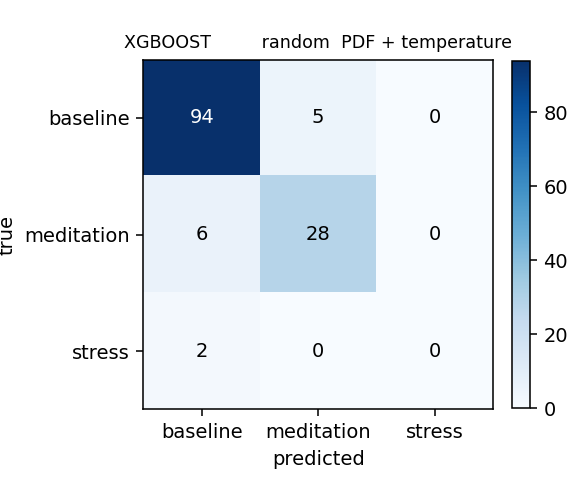 |

### 5.6 Random 70:15:15 — 1D-CNN

| PDF channels (3 ch) | + temperature (4 ch) |
|---|---|
| 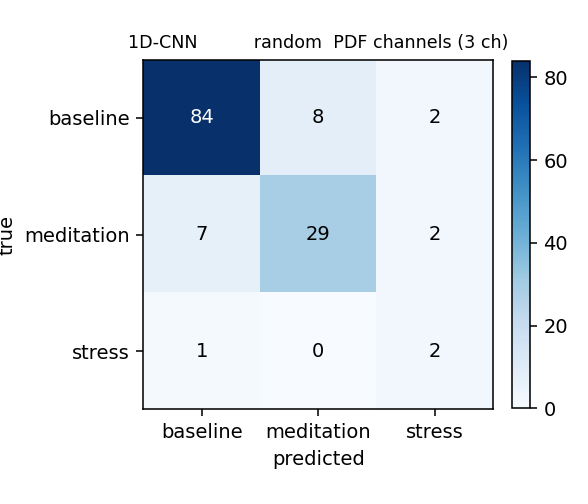 | 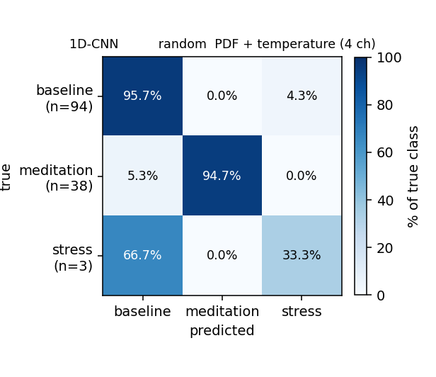 |

---

## 6. Key findings

1. **XGBoost on the 8 PDF features is the strongest single model under LORO** at macro-F1 **0.825**, beating RandomForest (0.764), KNN (0.686), and the 1D-CNN with PDF channels (0.349). With only 180 windows total, dense hand-crafted physiology features beat raw waveforms.
2. **Temperature flips the picture between classical and deep models.**
   * For all three classical models, adding temperature **hurts** macro-F1 (KNN −0.063, RF −0.018, XGB −0.033). For XGBoost it also erases the only working stress predictions (F1[stress] 0.143 → 0.000).
   * For the 1D-CNN, adding temperature **lifts** macro-F1 by **+0.262** (0.349 → 0.611). The CNN can't easily extract HRV from raw ECG with only 174 windows, so it leans on the temperature drift as a cheap discriminator.
3. **All three classical models almost never predict `stress`.** Look at the `stress` prediction column (rightmost) in any LORO confusion matrix — it is solid zeros except XGBoost-PDF-only catching 1 out of 4. With only 2–4 stress windows in training, no tree split fires on stress.
4. **The 1D-CNN is the only model that calls `stress` correctly under LORO** (PDF+temp: 2 of 4 right) — but it also mislabels 9 baseline windows as `stress`. Class-weighted cross-entropy forces the network to attempt the rare class; the price is precision.
5. **The `stress` class is a data bottleneck, not a model bottleneck.** Only 4 stress windows exist across the entire dataset, all from two `pla-*` recordings. Under LORO, 5 of 7 folds have zero stress in the test set, so F1[stress] is structurally 0 for those folds. The single most impactful next step is collecting more `pla-*` recordings.
6. **Random-split numbers are misleading for the CNN.** The +0.45 LORO→random-split delta is overlap leakage (50 % window overlap → adjacent windows split between train and test). For a fair cross-recording claim, only LORO numbers should be quoted.

---

## 7. Advice / next steps

1. **Adopt XGBoost on the 8 PDF features as the production baseline.** macro-F1 0.825 under honest LORO. Drop temperature from the classical feature set — it never beats the PDF set and destroys the only working stress predictions.
2. **Collect more `pla-*` (stress) recordings.** Highest-leverage single change. Going from 4 stress windows to ~50 would make F1[stress] statistically meaningful and very likely lift macro-F1 across every model.
3. **Treat the 1D-CNN as research, not production.** Its strong dependence on temperature (and on overlap leakage under random split) indicates it can't yet extract HRV from raw ECG at this data scale. Keep it on hand to revisit once more data is available.
4. **Report per-fold spread, not just the mean.** XGBoost LORO macro-F1 ranges from 0.46 to 1.00 across folds. A single mean understates the uncertainty.

---

## 8. Reproduce

```bash
# Classical models, LORO + temperature ablation
uv run python -m src.local_eval

# Classical models, 5-seed random 70:15:15 split
uv run python -c "from src.local_eval import run_random_split_temp_ablation; run_random_split_temp_ablation()"

# 1D-CNN, LORO + temperature ablation
uv run python -m src.dl_train

# 1D-CNN, 5-seed random 70:15:15 split
uv run python -c "from src.dl_train import run_random_split_temp_ablation; run_random_split_temp_ablation()"

# Regenerate all confusion matrices and heatmap PNGs
uv run python scripts/show_confusion_matrices.py > confusion-matrices.md
```

Output locations:
- `outputs/local_loro_temp_ablation.json`, `outputs/dl_local_loro_temp_ablation.json`
- `outputs/local_randomsplit_temp_ablation.json`, `outputs/dl_local_randomsplit_temp_ablation.json`
- `figures/confusion/*.png` (tracked in git)
- `confusion-matrices.md` (16 markdown tables, regenerable from the JSONs)
