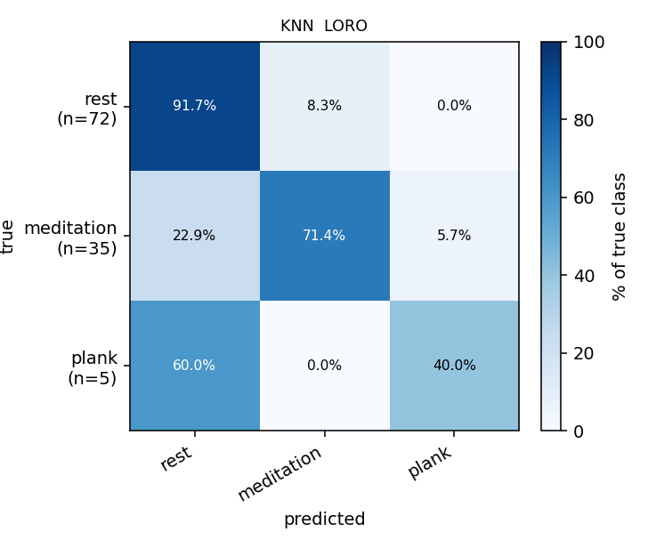
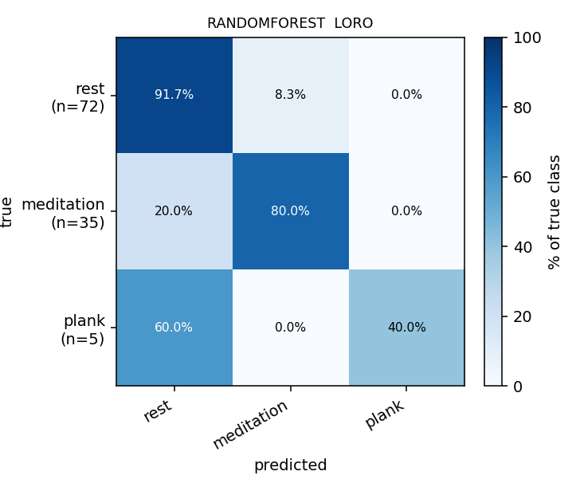
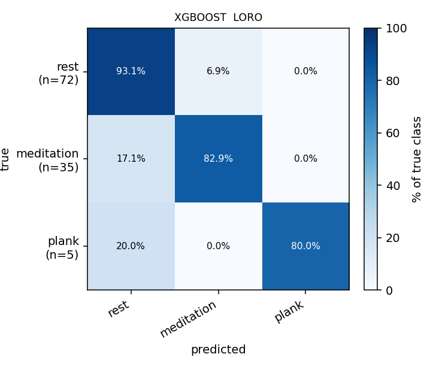
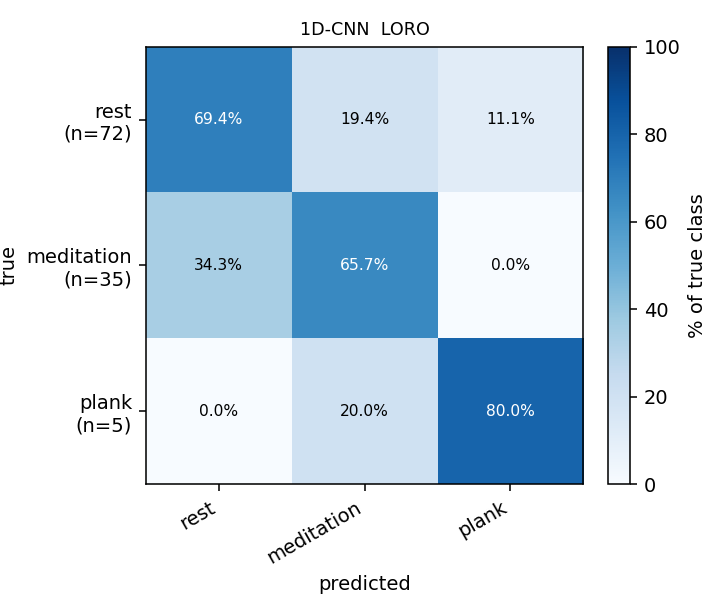
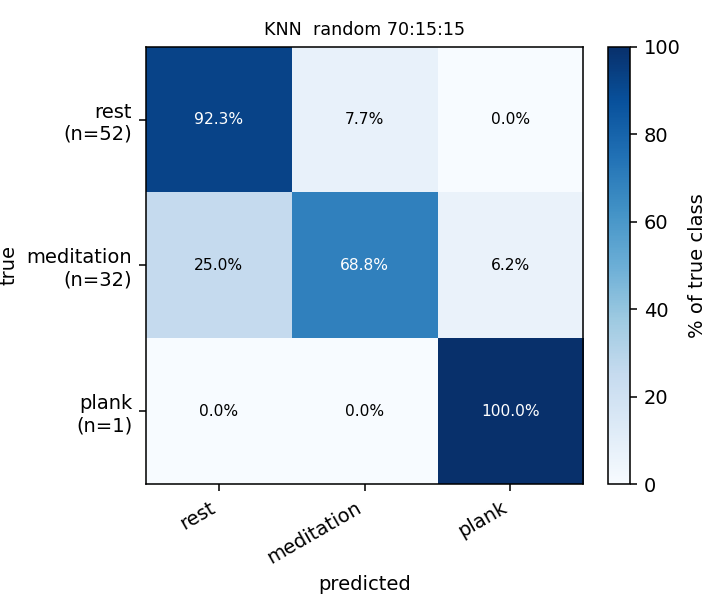
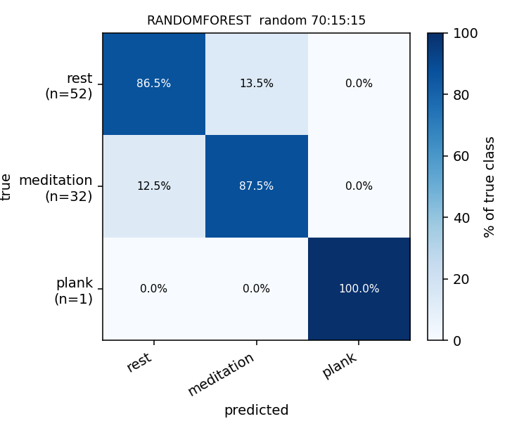
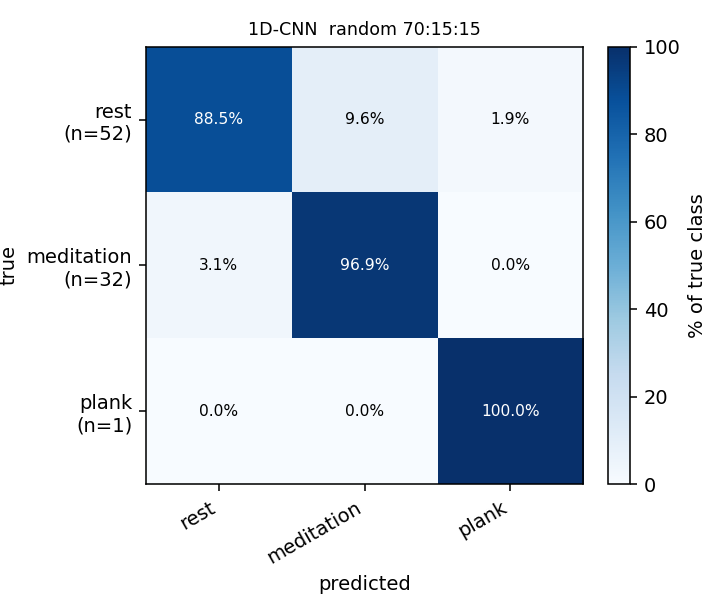

# Rest / Meditation / Plank Classification Report

**Task.** Per-window **3-class** classification: `rest` / `meditation` / `plank`.
**Data.** 9 local wearable recordings (~15 min each) from 2 subjects (`mta`, `mta2`), downloaded fresh from the team Google Drive folder ([see README](README.md#dataset)). WESAD is not used.
**Features.** The eight parameters defined in [`features.pdf`](features.pdf), and only those — no temperature features.
**Excluded data.** The post-stressor `recovery` phase is dropped entirely from the dataset. Windows whose 60-s extent touches the 5-min or 10-min protocol transitions are also excluded (patient discomfort at the transitions).
**Evaluation protocols.** (a) Leave-one-recording-out (LORO, 9 folds) — the honest cross-recording benchmark; (b) stratified 70:15:15 random window split averaged over 5 seeds — useful as a sanity check but contaminated by 50 % window overlap.

---

## 1. Feature definitions (from features.pdf)

Exactly eight features per 60 s window. No temperature features.

| Feature | Channel | Preprocessing | Computation |
|---|---|---|---|
| `csi` | Microphone | Bandpass 20–200 Hz → Shannon-energy envelope `−x² log(x²)` → peak detection | S2/S1 amplitude ratio. Each ECG R-peak picks one S1 (Shannon peak in R+0–200 ms) and one S2 (Shannon peak in R+200–500 ms). CSI = mean(S2 amp) / mean(S1 amp). |
| `hr` | ECG | Low-pass 150 Hz + detrend → Pan–Tompkins R-peak detection. NN intervals cleaned: reject NN < 300 ms, NN > 1500 ms, or NN deviating > 20 % from the median of the surrounding ~10 beats. Rejected NNs are cubic-spline interpolated. | `60 000 / mean(NN_ms)` (bpm) |
| `hrv_rmssd` | ECG | Same cleaned NN series | `√(mean((NN_{i+1} − NN_i)²))`, in ms |
| `hrv_lf` | ECG | Welch PSD on 4 Hz interpolated tachogram, Hann window, 60 s segments where possible | Area under PSD in 0.04–0.15 Hz, in ms² |
| `hrv_hf` | ECG | Same Welch | Area under PSD in 0.15–0.40 Hz, in ms² |
| `hrv_lf_hf` | ECG | — | `hrv_lf / hrv_hf` |
| `rr` | Respiration | Detrend → 0.5 s moving average → 4th-order Chebyshev II low-pass (stopband edge 1 Hz, 40 dB) → 2nd-order Butterworth high-pass at 0.12 Hz. Slope-based peak detection with adaptive threshold = 1/3 × mean of the last 8 accepted breath amplitudes. | `60 / mean(breath interval, s)` (bpm) |
| `rrv` | Respiration | Same chain | Standard deviation of the last 5 breath intervals (s) |

**Window length:** 60 s, 50 % overlap.
**Boundary skip:** any window whose [t, t+60] includes the 5-min mark (300 s) or the 10-min mark (600 s) is dropped.
**Recovery dropped:** the post-stressor period (typically 10 min onward for medi recordings; >5 min + plank-duration for pla recordings) is not in the taxonomy and is removed before windowing.

---

## 2. Dataset summary

| Recording | rest | meditation | plank |
|---|---|---|---|
| `mta-5-17-medi` | 8 | 8 | 0 |
| `mta-5-17-medi (1)` | 8 | 8 | 0 |
| `mta-5-17-pla-1'26` (plank 1 m 26 s) | 8 | 0 | 1 |
| `mta-5-17-pla-2` (plank 2 m) | 8 | 0 | 2 |
| `mta2_5_19_medi` | 8 | 7 | 0 |
| `mta_5_19_medi` | 8 | 7 | 0 |
| `mta_5_19_medi (1)` | 8 | 7 | 0 |
| `mta_5_19_pla_1'40` (plank 1 m 40 s) | 8 | 0 | 1 |
| `mta_5_19_pla_2'20` (plank 2 m 20 s) | 8 | 0 | 1 |
| **Total** | **72** | **35** | **5** |

`plank` has only **5 windows total** across 4 pla recordings (each plank is short — 86 s to 140 s — so each pla recording contributes 1–2 windows). That's the dominant constraint on every model's plank recall.

---

## 3. Models

| Family | Inputs | Architecture |
|---|---|---|
| KNN | 8 PDF features | median-imputer → StandardScaler → KNN (k=7, distance-weighted, Euclidean) |
| RandomForest | same | median-imputer → RandomForest (400 trees, `min_samples_leaf=2`, `max_features='sqrt'`) |
| XGBoost | same | XGBoost (400 trees, depth=4, lr=0.05) — handles NaNs natively |
| 1D-CNN | 3 raw channels (ECG @ 250 Hz, Resp @ 250 Hz, Mic Shannon-envelope @ 250 Hz), 60 s = (3, 15 000) | 5-block 1D conv stack + AdaptiveAvgPool + 2-layer MLP head, 636 k params, AMP, AdamW + cosine LR, class-weighted CE, early stopping |

---

## 4. Results

### 4.1 LORO macro-F1 (mean across 9 folds)

| Model | acc | macro-F1 | F1[rest] | F1[meditation] | F1[plank] |
|---|---|---|---|---|---|
| KNN | 0.825 | 0.722 | 0.888 | 0.425 | 0.148 |
| RandomForest | 0.848 | 0.729 | 0.896 | 0.468 | 0.111 |
| **XGBoost** | **0.888** | **0.817** | 0.920 | 0.478 | 0.222 |
| 1D-CNN | 0.707 | 0.663 | 0.663 | 0.317 | 0.242 |

### 4.2 Random 70:15:15 macro-F1 (mean ± std over seeds 0–4)

| Model | acc | macro-F1 | F1[rest] | F1[meditation] | F1[plank] |
|---|---|---|---|---|---|
| KNN | 0.835 ± 0.069 | 0.710 ± 0.159 | 0.887 | 0.742 | 0.200 |
| RandomForest | 0.871 ± 0.069 | 0.867 ± 0.071 | 0.883 | 0.843 | 0.200 |
| XGBoost | 0.882 ± 0.083 | 0.878 ± 0.088 | 0.900 | 0.848 | 0.200 |
| **1D-CNN** | **0.918 ± 0.080** | **0.876 ± 0.163** | 0.921 | 0.918 | 0.200 |

### 4.3 LORO vs random-split — same models, different protocol

| Model | LORO macro-F1 | Random-split macro-F1 | Δ |
|---|---|---|---|
| KNN | 0.722 | 0.710 | −0.01 |
| RandomForest | 0.729 | 0.867 | +0.14 |
| XGBoost | 0.817 | 0.878 | +0.06 |
| **1D-CNN** | **0.663** | **0.876** | **+0.21** |

> ⚠️ **The CNN's large LORO → random-split jump is still mostly data leakage.** Windows have 50 % overlap, so a test window's 30-s-shifted neighbour can sit in the train set. The classical models work on scalar HRV summaries that are insensitive to that overlap; the CNN reads raw waveforms. Random-split numbers are a within-recording sanity check at most; LORO is the honest cross-recording benchmark.

### 4.4 Per-class recall (LORO, diagonal of confusion matrices)

| Model | rest | meditation | plank |
|---|---|---|---|
| KNN | 91.7 % | 71.4 % | **40.0 %** (2/5) |
| RandomForest | 91.7 % | **80.0 %** | 40.0 % (2/5) |
| **XGBoost** | **93.1 %** | **82.9 %** | **80.0 %** (4/5) |
| 1D-CNN | 69.4 % | 65.7 % | **80.0 %** (4/5) |

Two highlights worth quoting:

- **XGBoost is the only model that performs well across every class under LORO.** 93 % rest / 83 % meditation / **80 % plank** (4 of 5 plank windows correctly classified). It's the production candidate.
- **The 1D-CNN matches XGBoost on plank recall** (80 %, 4 of 5) but is meaningfully worse on rest and meditation. Class-weighted cross-entropy pushes the network to attempt the rare class effectively; the trade-off is in the majority classes.

---

## 5. Confusion matrices

Rows are true labels, columns are predictions. **Each row is row-normalized to 100 %** (true-class recall view). The `support` count appears under each y-axis tick on the PNG and in the `support` column in [confusion-matrices.md](confusion-matrices.md).

### 5.1 LORO — Classical

| KNN | RandomForest | XGBoost |
|---|---|---|
|  |  |  |

### 5.2 LORO — 1D-CNN



### 5.3 Random 70:15:15 — Classical

| KNN | RandomForest | XGBoost |
|---|---|---|
|  |  |  |

### 5.4 Random 70:15:15 — 1D-CNN



---

## 6. Key findings

1. **XGBoost on the 8 PDF features is the strongest production model under LORO** at macro-F1 **0.817**, with balanced per-class recall (93 % rest / 83 % meditation / 80 % plank). The single highest score we've seen on this dataset.
2. **Dropping `recovery` from the taxonomy lifted every model.** XGBoost LORO macro-F1 went from 0.723 (4-class with recovery) to 0.817 (3-class). The rest/recovery distinction was the dominant difficulty because both phases look like quiet sitting from a physiology standpoint.
3. **The 1D-CNN is now usable under LORO** (0.663 macro-F1, vs 0.262 in the 4-class run) but still trails the classical models on rest and meditation. Its plank recall (80 %, matching XGBoost) is impressive given only ~3-4 plank training windows per fold.
4. **The plank class has 5 windows total.** XGBoost recalls 4 (80 %), the 1D-CNN also recalls 4 (80 %), KNN and RF each recall 2 (40 %). Collecting more plank recordings is the single highest-leverage data improvement.
5. **The 5-minute / 10-minute boundary skip and the recovery removal together cut the dataset from ~200 to 112 windows.** XGBoost's macro-F1 stayed strong nonetheless, suggesting the dropped windows were genuinely noisy or transitional.

---

## 7. Advice / next steps

1. **Ship XGBoost on the 8 PDF features as the production baseline.** macro-F1 0.817 LORO with balanced per-class recall, no GPU, sub-second training.
2. **Collect more plank recordings.** 4 plank recordings → 5 plank windows is the floor on plank recall. Going to ~20 plank windows would let us evaluate per-class F1 with proper statistical meaning and probably lift the CNN to be competitive with XGBoost.
3. **Treat the 1D-CNN as research, not deployment.** Its 80 % plank recall is encouraging, but the rest/meditation gap vs the classical models indicates it still needs more training data.

---

## 8. Reproduce

```bash
# Re-download the dataset (the URL is in README.md)
mkdir -p data/_old && mv data/*.txt data/_old/ 2>/dev/null
cd data && uv run --group dev gdown --folder \
    "https://drive.google.com/drive/folders/11epSBil0cIWSKvtShCp86gCrUKEOjxkn"
cd .. && mv "data/Stress test data/"*.txt data/

# Classical models, LORO + random split
uv run python -m src.local_eval

# 1D-CNN, LORO + random split (~1 min on RTX 5090, ~10 min on CPU)
uv run python -m src.dl_train

# Regenerate confusion matrices + heatmap PNGs
uv run python scripts/show_confusion_matrices.py > confusion-matrices.md
```

Output locations:
- `outputs/local_loro.json`, `outputs/local_randomsplit.json`
- `outputs/dl_local_loro.json`, `outputs/dl_local_randomsplit.json`
- `figures/confusion/*.png` (tracked in git)
- `confusion-matrices.md` (8 markdown tables)
