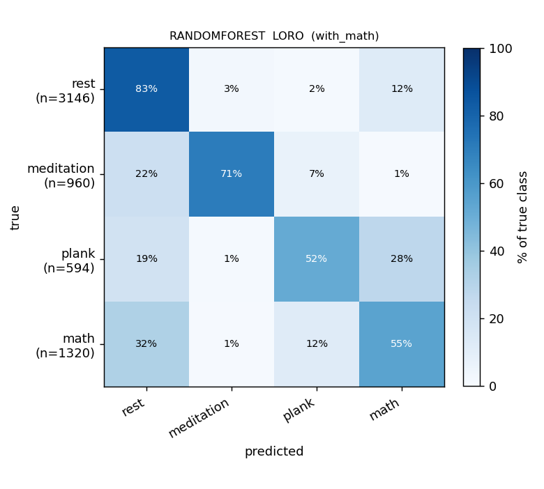
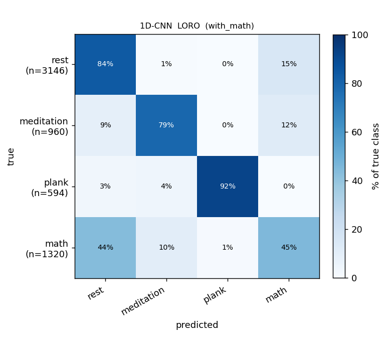

# ML report — sliding BR detector

> 4-class run with `BR_PEAK_METHOD=sliding` (60-s window stepped by 30 s,
> local p90 prominence floor) instead of the neurokit default. Same dataset,
> same exclusions, same anchor grid, same models, same 9 features.
> Sister to [`ml-report.md`](ml-report.md); the Poincaré diagnostics in
> [`poincare-report.md`](poincare-report.md) apply equally to both detectors
> (NN intervals come from ECG only).

## What changes vs the neurokit report

| What | neurokit run | this run (sliding) |
|---|---|---|
| BR peak detector | `neurokit2.rsp_peaks` (biosppy) | local-p90 sliding (60-s window, 30-s step) |
| BR breath intervals recovered (all phases) | 2 588 | **3 862**  (+49 %) |
| `rr` / `rrv` values | inputs from neurokit BR peaks | inputs from sliding BR peaks |
| `csi` / `hr` / `hrv_rmssd` / `sd1` / `sd2` / `sd1_sd2` / `ss` | (ECG-only — identical to sliding) | (ECG-only — identical to neurokit) |
| 1D-CNN inputs | filtered BR **waveform** (`pp.br`) | same waveform — detector-invariant |
| Number of windows / partial exclusions / boundary buffer | identical | identical |

So the apples-to-apples ablation is **just `rr` + `rrv`** for the classical
models, and **just training-seed noise** for the CNN.

## Setup

- 31 recordings, 10 subjects, 4 classes (`rest` / `meditation` / `plank`
  / `math`). 14 files moved to `data/_excluded/`; 5 partial-rest exclusions
  applied per `src/exclusions.py`. See [`ml-report.md`](ml-report.md#setup)
  for the full list.
- **Anchor-based windowing**, 2-s slide. Per-feature centered windows:
  HR 10 s; RR/CSI 40 s; RMSSD / Poincaré / RRV 60 s. Asymmetric
  −10 / +30 s boundary buffer around the 5-min cue. Recovery dropped.
- **Window counts:** 6 020 anchors total — 3 146 rest / 960 medi / 594
  plank / 1 320 math (same as neurokit).
- **Protocol:** LORO only (pooled macro-F1). The 5-seed random 70:15:15
  split has been dropped — at a 2-s anchor step neighbouring windows are
  near-duplicates and the random-split score is meaningless.

## Headline — pooled-LORO macro-F1 (sliding BR detector)

| Model | acc | macro-F1 | F1[rest] | F1[medi] | F1[plank] | F1[math] |
|---|---:|---:|---:|---:|---:|---:|
| KNN              | 0.690 | 0.642 | 0.78 | 0.76 | 0.54 | 0.49 |
| RandomForest     | 0.719 | 0.665 | 0.80 | 0.78 | 0.52 | 0.55 |
| **XGBoost**      | **0.761** | **0.718** | 0.83 | **0.90** | 0.58 | **0.56** |
| 1D-CNN           | 0.753 | 0.756 | 0.82 | 0.80 | **0.94** | 0.47 |

## Head-to-head: sliding vs neurokit (pooled-LORO macro-F1)

| Model | neurokit | sliding | Δ |
|---|---:|---:|---:|
| KNN          | 0.593 | 0.642 | **+0.049** |
| RandomForest | 0.629 | 0.665 | **+0.036** |
| XGBoost      | 0.690 | 0.718 | **+0.028** |
| 1D-CNN       | 0.767 | 0.756 |  −0.011 |

Per-class deltas for XGBoost (where the classical-feature swap shows up
most clearly):

| Class | neurokit F1 | sliding F1 | Δ |
|---|---:|---:|---:|
| rest        | 0.80 | 0.83 | +0.03 |
| meditation  | 0.85 | **0.90** | +0.05 |
| plank       | 0.58 | 0.58 |  0.00 |
| math        | 0.53 | 0.56 | +0.03 |

**Reading.** The sliding detector recovers ~50 % more breath events,
mostly in low-amplitude rest passages. This produces tighter `rr` /
`rrv` estimates on rest and meditation windows, which is exactly where
classical XGBoost's biggest gains land (medi +0.05 F1, rest +0.03). The
CNN moves within seed noise (−0.011) — it doesn't read peaks, so the
detector swap should not affect it structurally.

## Confusion matrices (LORO, row-normalized, sliding)

| KNN | RandomForest | XGBoost | 1D-CNN |
|---|---|---|---|
|  |  |  |  |

Numeric form (rows = true class):

**XGBoost (sliding)**

|             | rest | medi | plank | math |
|---|---:|---:|---:|---:|
| rest        | 0.85 | 0.01 | 0.02 | 0.12 |
| meditation  | 0.07 | **0.89** | 0.04 | 0.01 |
| plank       | 0.13 | 0.04 | 0.53 | 0.30 |
| math        | 0.37 | 0.01 | 0.07 | 0.56 |

**1D-CNN (sliding)**

|             | rest | medi | plank | math |
|---|---:|---:|---:|---:|
| rest        | 0.84 | 0.01 | 0.00 | 0.15 |
| meditation  | 0.09 | 0.79 | 0.00 | 0.12 |
| plank       | 0.03 | 0.04 | **0.92** | 0.00 |
| math        | 0.44 | 0.10 | 0.01 | 0.45 |

## Findings

1. **XGBoost is now the top classical model at 0.718 macro-F1**, ahead
   of RF (0.665) and KNN (0.642). The sliding detector's denser BR pool
   tightens the meditation class especially — XGBoost's medi F1 jumps
   from 0.85 (neurokit) to **0.90** (sliding).
2. **The 1D-CNN sits at 0.756** — essentially tied with XGBoost (within
   training-seed noise) and ~0.01 below its neurokit run. Detector-swap
   variance is small enough that the CNN ranking vs XGBoost is now
   ambiguous; either one is a defensible "best model" pick on this run.
3. **Plank stays the CNN's strongest class** (F1 0.92) and a soft spot
   for the classical models (F1 0.52-0.58). The mic / waveform features
   the CNN consumes carry signal the 9-feature classical models don't.
4. **`math` is still the hardest cross-subject class** (best F1 0.56
   from XGBoost). The confusion matrices show 37–44 % of math windows
   spilling into `rest` — a real subject-level overlap, not a feature
   problem.
5. **The sliding detector wins for classical models, neurokit wins for
   the CNN**, but both gaps are small (~0.01–0.05 macro-F1). The
   practical recommendation is **sliding when classical models are in
   play**, neurokit when the pipeline is CNN-only.

## Reproduce

```bash
BR_PEAK_METHOD=sliding uv run python scripts/run_split_reports.py
```

Outputs land in `outputs/split_reports.json` (numbers) and
`figures/with_math/confusion/loro__*.png` (PNGs). The sliding-specific
JSON is snapshotted at `outputs/split_reports_sliding.json` and the
figures are mirrored to `report/figures/confusion_sliding/`.
