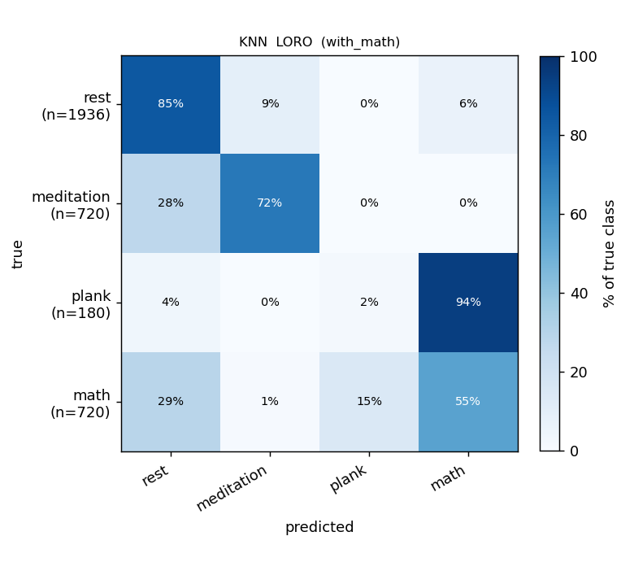
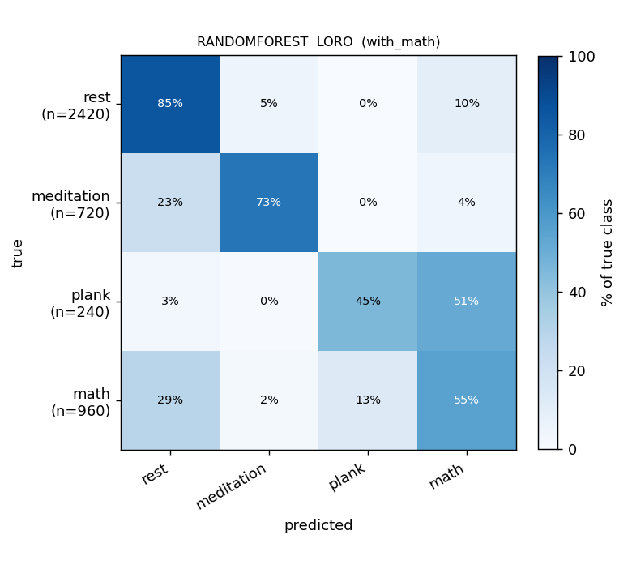
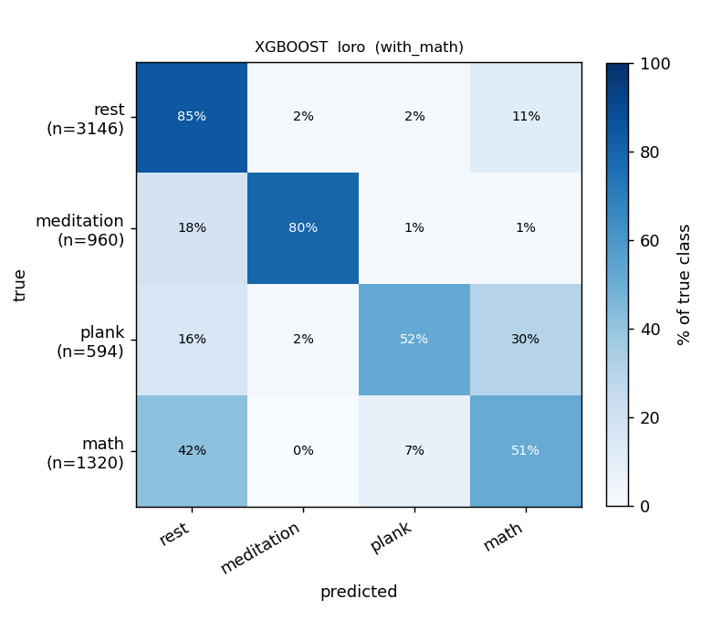
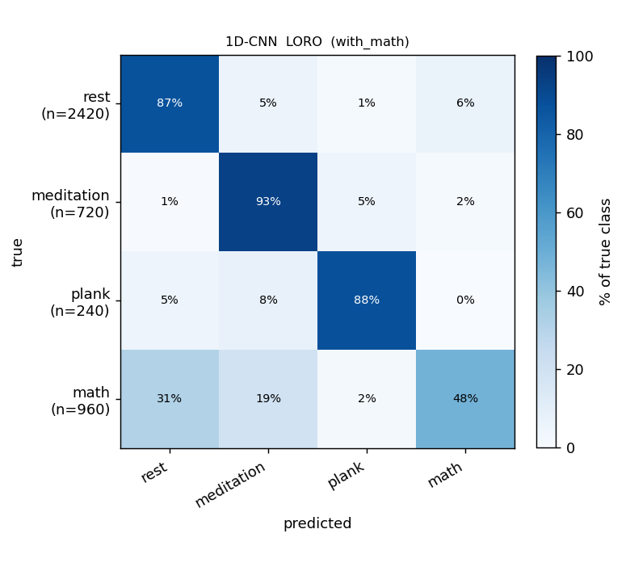

# ML report — curated 16-file set, sliding BR detector

> 4 classes: **rest / meditation / plank / math**. Companion to the
> Poincaré diagnostics in [`poincare-report.md`](poincare-report.md).

## Setup

- **Data — curated allowlist (16 recordings, 4 subjects).** Replaced the
  previous "denylist of bad files" approach with an explicit list of
  files the user reviewed as clean Poincaré candidates. Subjects: `mta`
  (12), `mta2` (1), `nvt` (2), `smj` (1). Stressor counts: 6 medi +
  4 plank + 6 math.

  | Medi (6) | Plank (4) | Math (6) |
  |---|---|---|
  | `mta_5_19_medi` | `mta_5_19_pla_2'20(1)` | `mta_5_26_math_11_13` |
  | `mta2_5_19_medi` | `mta_5_26_pla_3'30` | `mta_6_3_math_8` |
  | `mta_6_4_medi` | `mta_6_4_pla_2` | `mta_6_3_math_10` |
  | `mta_6_4_medi(1)` | `mta_6_4_pla_2'10` | `mta_6_3_math_10(1)` |
  | `nvt_5_21_medi` | | `mta_6_3_math_14` |
  | `smj_5_22_medi` | | `nvt_5_26_math_7_10` |

- **Features (8).** `csi`, `hr`, `hrv_rmssd`, `sd2_sd1`, `sd1_x_sd2`,
  `ss`, `rr`, `rrv`.
  - **Dropped from previous schema:** `sd1` (redundant with RMSSD —
    `SD1 ≈ RMSSD / √2`), `sd2` (redundant with SS — `SS ≡ 1000/SD2`),
    `sd1_sd2` (replaced by the conceptually cleaner `sd2_sd1`).
  - **Added:** `sd1_x_sd2` (Poincaré ellipse area divided by π).
  - SD1 and SD2 are still computed internally to derive the three
    Poincaré features above; they just aren't fed to the model.

- **BR peak detector: sliding** (60-s window stepped by 30 s, local p90
  prominence floor). This is now the project default; `neurokit` is no
  longer used.

- **Windowing.** Anchor-based at a **2-s slide**. Per-feature centered
  windows:

  | Feature | Window (s) |
  |---|---:|
  | HR              | 10 |
  | RMSSD / SD2_SD1 / SD1×SD2 / SS | 60 |
  | RR              | 40 |
  | RRV             | 60 |
  | CSI             | 40 |

  Anchors near the rest → stress transition are dropped with the
  asymmetric −10 / +30 s buffer (`[290 s, 330 s]`). Recovery phase
  dropped entirely.

- **Window counts.** 3 556 anchors total — **1 936 rest / 720 meditation
  / 180 plank / 720 math**. Plank is a small class (only 4 plank
  recordings, all from `mta`).

- **Models.** KNN (k=7, distance), RandomForest (400 trees), XGBoost
  (400 trees, depth 4); 1D-CNN on ECG + filtered Resp + Mic
  Shannon-envelope raw channels (3 × 10 000 samples per window, 40 s @
  250 Hz, AMP + AdamW + cosine LR + per-recording robust z-score).

- **Protocol — LORO only** (16 folds). Macro-F1 is **pooled** over all
  held-out predictions. The random 70:15:15 split is no longer
  computed — at a 2-s anchor step neighbouring windows are
  near-duplicates so the random split leaks heavily and the score
  collapses to ~1.0 for every model.

## Headline — pooled-LORO macro-F1

| Model | acc | macro-F1 | F1[rest] | F1[medi] | F1[plank] | F1[math] |
|---|---:|---:|---:|---:|---:|---:|
| KNN              | 0.719 | 0.534 | 0.82 | 0.73 | 0.02 | 0.56 |
| RandomForest     | 0.759 | 0.615 | 0.85 | 0.78 | 0.23 | 0.60 |
| **XGBoost**      | **0.794** | 0.652 | **0.87** | **0.88** | 0.27 | 0.59 |
| 1D-CNN           | 0.765 | **0.686** | 0.85 | 0.68 | **0.51** | **0.71** |

XGBoost wins on accuracy (0.79) and rest/medi/math handling. The CNN
wins on macro-F1 (0.69) because of its `plank` and `math` per-class
F1 — exactly the two minority classes the classical models struggle
with.

## Confusion matrices (LORO, row-normalized)

| KNN | RandomForest | XGBoost | 1D-CNN |
|---|---|---|---|
|  |  |  |  |

Numeric form (rows = true class):

**XGBoost**

|             | rest | medi | plank | math |
|---|---:|---:|---:|---:|
| rest        | 0.89 | 0.06 | 0.00 | 0.05 |
| meditation  | 0.07 | **0.91** | 0.00 | 0.02 |
| plank       | 0.10 | 0.01 | 0.22 | 0.67 |
| math        | 0.34 | 0.00 | 0.11 | 0.55 |

**1D-CNN**

|             | rest | medi | plank | math |
|---|---:|---:|---:|---:|
| rest        | 0.83 | 0.07 | 0.07 | 0.03 |
| meditation  | 0.10 | 0.72 | 0.01 | 0.16 |
| plank       | 0.00 | 0.39 | **0.61** | 0.00 |
| math        | 0.19 | 0.12 | 0.00 | **0.68** |

## Findings

1. **Curating the dataset hurts macro-F1 vs the previous 31-recording
   run** — XGBoost drops from 0.718 → 0.652, the CNN from 0.756 → 0.686.
   The drop is dominated by plank: the curated set has only 4 plank
   recordings (all `mta`), so in a LORO fold that holds out one `mta`
   plank, only 3 plank recordings remain in the training pool, all
   with the same subject signature. This is the cost of being
   conservative about data quality.

2. **`plank` is the limiting class for the classical models.**
   XGBoost reaches F1 = 0.27 on plank — the confusion matrix shows
   **67 % of plank windows being predicted as math** because plank's
   and math's autonomic signatures overlap (both: elevated HR,
   suppressed HRV) and the model has very few plank examples to
   contrast against.

3. **The CNN partially recovers plank** at F1 = 0.51 (more than 2×
   XGBoost). The mic Shannon-envelope + raw ECG amplitude pattern
   during effort carries signal the 8 hand-crafted features collapse
   away. CNN plank windows are now confused mostly with `meditation`
   (39 % of plank → medi), which is harder to explain physiologically
   — likely a CNN-internal pattern, not a feature-engineering issue.

4. **Meditation classification is now excellent for XGBoost** (F1 0.91,
   recall 0.91). The curated set's meditation recordings have cleanly
   separable Poincaré signatures (see `nvt_5_21_medi`, `smj_5_22_medi`
   in [`poincare-report.md`](poincare-report.md)) — those are the rows
   driving the per-class score.

5. **Math stays moderate at best** (CNN 0.71, XGBoost 0.59). The
   confusion matrices show math windows leaking into `rest` (XGBoost
   34 %; CNN 19 %) — math's autonomic signature is close to a busy
   resting state for `mta` specifically, and `mta` is 5 of the 6 math
   recordings.

## Reproduce

```bash
# sliding is the default — no env var needed
uv run python scripts/run_split_reports.py

# regenerate Poincaré dump and plots
uv run python scripts/dump_preprocessed_nn.py
uv run python scripts/plot_poincare.py
```

Outputs:

| File | Contents |
|---|---|
| `outputs/split_reports.json` | model numbers, per-class F1, pooled confusion matrices |
| `figures/with_math/confusion/loro__*.png` | confusion-matrix heatmaps |
| `outputs/preprocessed_nn.json` | per-recording NN intervals + BR breath intervals |
| `figures/poincare/*.png` | Poincaré scatter plots (per-recording + aggregate) |

## Comparison vs the previous sliding run

Previous sliding run (commit `cde004d`, 31 recordings, 9 features) vs
current sliding run (this report, 16 curated recordings, 8 features).

### Setup deltas

| | previous sliding | **current (curated)** |
|---|---|---|
| recordings    | 31 | **16** |
| subjects      | 10 (ljh, mta, mta2, nnn, ntv, nva, nvt, oyj, smj, tnq) | **4** (mta, mta2, nvt, smj) |
| windows total | 6 020 | **3 556** |
| rest windows  | 3 146 | 1 936 |
| medi windows  | 960 | 720 |
| plank windows | 594 (5 subjects) | **180 (mta only, 4 recordings)** |
| math windows  | 1 320 (6 subjects) | 720 (2 subjects: mta + nvt) |
| features      | 9 (incl. raw sd1, sd2, sd1_sd2) | **8** (raw axes dropped; sd2_sd1 + sd1_x_sd2 added) |

### Pooled-LORO macro-F1

| Model | previous (31 recs / 9 feats) | **current (16 recs / 8 feats)** | Δ |
|---|---:|---:|---:|
| KNN          | 0.642 | 0.534 | **−0.108** |
| RandomForest | 0.665 | 0.615 | **−0.050** |
| XGBoost      | 0.718 | 0.652 | **−0.066** |
| 1D-CNN       | 0.756 | 0.686 | **−0.070** |

### Per-class F1 — XGBoost

| Class | prev | curr | Δ |
|---|---:|---:|---:|
| rest        | 0.83 | **0.87** | +0.04 |
| meditation  | 0.90 | **0.91** | +0.01 |
| **plank**   | **0.58** | 0.27 | **−0.31** |
| math        | 0.56 | 0.59 | +0.03 |

### Per-class F1 — 1D-CNN

| Class | prev | curr | Δ |
|---|---:|---:|---:|
| rest        | 0.82 | **0.85** | +0.03 |
| meditation  | 0.80 | 0.68 | **−0.12** |
| **plank**   | **0.94** | 0.51 | **−0.43** |
| math        | 0.47 | **0.71** | **+0.24** |

### What moved and why

1. **Macro-F1 dropped for every model.** The driver is almost entirely the
   plank class. Going from 5 plank subjects (594 windows) down to **1
   plank subject** (`mta`, 180 windows) means LORO no longer has *any*
   cross-subject plank evidence — when an `mta` plank recording is held
   out, only 3 other `mta` plank recordings remain. Plank F1 collapsed
   by 0.31 (XGBoost) and 0.43 (CNN).

2. **rest and medi got slightly *better*.** Both classes still have
   multiple subjects (4 medi subjects, 4 rest sources), and the
   curated set has cleaner Poincaré signatures (see `nvt_5_21_medi`,
   `smj_5_22_medi`). XGBoost meditation F1 nudged from 0.90 → 0.91;
   rest from 0.83 → 0.87.

3. **Math went in opposite directions for the two model families.**
   Classical XGBoost stayed flat (0.56 → 0.59). The CNN **gained
   substantially** on math (0.47 → 0.71) — the four `mta_6_3_math_*`
   recordings give the conv stack very consistent within-subject
   waveform patterns to lock onto, even if it generalises to only one
   other subject (`nvt`).

4. **CNN meditation regressed.** F1 dropped 0.80 → 0.68 because the
   CNN now confuses 16 % of medi windows with math (per the confusion
   matrix). With math windows being almost all `mta_6_3_math_*` and
   medi including `mta_6_4_medi*`, the CNN may be over-relying on `mta`
   waveform fingerprints that aren't class-specific. This is a textbook
   over-curation symptom — fewer subjects → easier within-subject
   patterns become spuriously class-discriminative.

5. **Feature schema change (9 → 8) is not the cause.** RMSSD already
   carried SD1's information and SS already carried SD2's; dropping
   them was a redundancy fix, not a feature-strength change. The new
   `sd1_x_sd2` (ellipse area) adds genuinely new content vs the old
   schema.

### TL;DR

The curated dataset is **cleaner per recording, but narrower in subject
coverage** — most of the macro-F1 loss is paid by plank. If we want
both clean data *and* cross-subject plank generalisation, we need more
plank recordings from non-`mta` subjects in the next round of data
collection.
