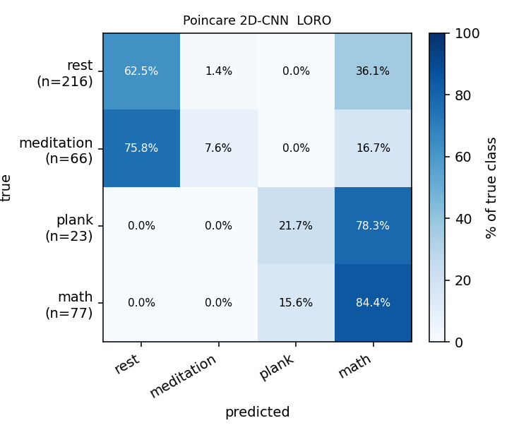

# Poincaré-image 2D-CNN — stress/activity classification

> 4 classes: **rest / meditation / plank / math**. ECG RR (NN) Poincaré plots rendered as 64×64 log-count **images** and classified with a small 2D-CNN.
> Companion to the feature-based [`ml-report.md`](ml-report.md) and the Poincaré diagnostics in [`poincare-report.md`](poincare-report.md).

## What this run is

Instead of feeding scalar Poincaré descriptors (SD1, SD2, …) to a classifier, each window's RR series is turned into a **2-D Poincaré image** and a convolutional net learns directly from the scatter shape. One image per window, one window every 20 s.

## Setup

- **Image.** x = RRₙ, y = RRₙ₊₁; range 300–1400 ms; **64×64** bins; value = **log(1+count)**; **per-image max** normalization. Single channel (64×64×1).
- **Windowing.** 60-s window, **20-s stride**, each window fully inside one phase (no cross-phase mixing).
- **Boundary exclusion.** Windows overlapping the 5-min cue **[290, 310] s** or the 10-min mark **[590, 610] s** are dropped. Recovery phase dropped (matches the rest of the project).
- **Partial exclusions (curator review).** `smj_6_6_math_17` removed entirely; `oyj_6_6_math_11` rest phase removed (math kept).
- **RR source.** Same pipeline as the classical features — wavelet 5–45 Hz ECG filter → neurokit R-peaks → NN cleaning (300–1500 ms reject + 20 % median-deviation reject + cubic-spline interpolation).
- **Model.**

  ```
  Input 64×64×1
  Conv2D(16,3×3,same) → BN → ReLU → MaxPool2×2     # 64→32
  Conv2D(32,3×3,same) → BN → ReLU → MaxPool2×2     # 32→16
  Conv2D(64,3×3,same) → BN → ReLU → GlobalAvgPool  # → 64
  Dense(64) → ReLU → Dropout(0.3) → Output(4)
  ```

  ~28 k parameters. Class-weighted cross-entropy, AdamW (lr 1e-3, wd 1e-4), cosine schedule, mild additive-noise augment, AMP on **CUDA (RTX 5090)**, early stopping on inner-val macro-F1.
- **Protocol — LORO** (leave-one-recording-out); one further recording held out per fold as the inner validation set.

## Dataset

- **382 windows**, **19 recordings**, 6 subjects (LORO = 19 folds).
- Class counts:

  | rest | meditation | plank | math | total |
  |---:|---:|---:|---:|---:|
  | 216 | 66 | 23 | 77 | 382 |

  > The class set is heavily imbalanced (rest ≫ plank). The 60-s window (vs the originally-requested 2 min) is what keeps plank trainable at all — at 2 min the plank phases (120–210 s) yield ~6 windows total.

## Headline — pooled-LORO

| Model | acc | macro-F1 | F1[rest] | F1[medi] | F1[plank] | F1[math] |
|---|---:|---:|---:|---:|---:|---:|
| **Poincaré 2D-CNN** | 0.562 | 0.249 | 0.611 | 0.036 | 0.090 | 0.259 |

Accuracy **0.562 ± 0.247**, macro-F1 **0.249 ± 0.125** (mean ± std across folds).

## Confusion matrix (LORO, summed across folds)



Row-normalized (rows = true class, % of that class):

| true \ pred | rest | meditation | plank | math | support |
|---|---:|---:|---:|---:|---:|
| **rest** | 62.5% | 1.4% | 0.0% | 36.1% | 216 |
| **meditation** | 75.8% | 7.6% | 0.0% | 16.7% | 66 |
| **plank** | 0.0% | 0.0% | 21.7% | 78.3% | 23 |
| **math** | 0.0% | 0.0% | 15.6% | 84.4% | 77 |

Raw counts:

| true \ pred | rest | meditation | plank | math |
|---|---:|---:|---:|---:|
| **rest** | 135 | 3 | 0 | 78 |
| **meditation** | 50 | 5 | 0 | 11 |
| **plank** | 0 | 0 | 5 | 18 |
| **math** | 0 | 0 | 12 | 65 |

## Per-fold results

| recording | test_n | macro-F1 | acc |
|---|---:|---:|---:|
| `ljh_6_5_pla_2` | 15 | 0.250 | 0.800 |
| `ljh_6_5_pla_2(1)` | 15 | 0.239 | 0.733 |
| `mta2_5_19_medi` | 23 | 0.191 | 0.435 |
| `mta_5_19_medi` | 23 | 0.100 | 0.217 |
| `mta_5_19_pla_2'20(1)` | 16 | 0.417 | 0.875 |
| `mta_5_26_math_11_13` | 23 | 0.363 | 0.739 |
| `mta_5_26_pla_3'30` | 19 | 0.290 | 0.579 |
| `mta_6_3_math_10` | 23 | 0.456 | 0.913 |
| `mta_6_3_math_10(1)` | 23 | 0.267 | 0.565 |
| `mta_6_3_math_14` | 23 | 0.381 | 0.696 |
| `mta_6_3_math_8` | 23 | 0.162 | 0.478 |
| `mta_6_4_medi` | 23 | 0.065 | 0.130 |
| `mta_6_4_medi(1)` | 23 | 0.182 | 0.522 |
| `mta_6_4_pla_2` | 15 | 0.439 | 0.867 |
| `mta_6_4_pla_2'10` | 15 | 0.184 | 0.467 |
| `nvt_5_21_medi` | 23 | 0.000 | 0.000 |
| `nvt_5_26_math_7_10` | 23 | 0.277 | 0.609 |
| `oyj_6_6_math_11` | 11 | 0.133 | 0.364 |
| `smj_5_22_medi` | 23 | 0.333 | 0.696 |

## Reading the result

1. **rest and math carry the score**; **meditation and plank are essentially not learned** cross-recording (medi F1 0.04, plank F1 0.09).
2. The confusion matrix shows the failure mode: **meditation is absorbed into rest/math** and **plank is absorbed into math** — from RR shape alone the net cannot separate the minority stress classes from the majority ones across unseen subjects.
3. Causes: (a) strong **class imbalance** (rest 216 vs plank 23); (b) **LORO is hard** — Poincaré shape has large per-subject baseline spread, so some folds collapse (e.g. `nvt_5_21_medi` F1 0.0); (c) **single modality** — only RR, vs the 8-feature / multi-channel pipelines in `ml-report.md`.
4. For reference, the feature-based 1D-CNN in `ml-report.md` reaches macro-F1 0.75 on the same recordings using ECG+Resp+Mic — the Poincaré-image-only model is well below that and should be read as a **single-modality baseline**, not a replacement.

## Reproduce

```bash
uv run python scripts/run_poincare.py
```

Outputs:

| File | Contents |
|---|---|
| `outputs/poincare_dataset.npz` | stacked 64×64 images + labels/meta |
| `outputs/poincare_loro.json` | per-fold + summary, confusion matrix |
| `figures/poincare_images/samples_by_class.png` | sample images per class |
| `figures/poincare_images/confusion_loro.png` | LORO confusion heatmap |
