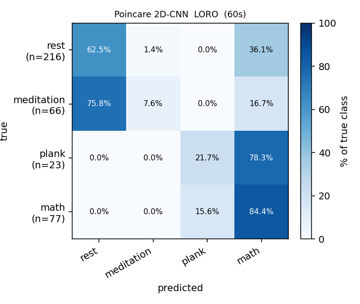
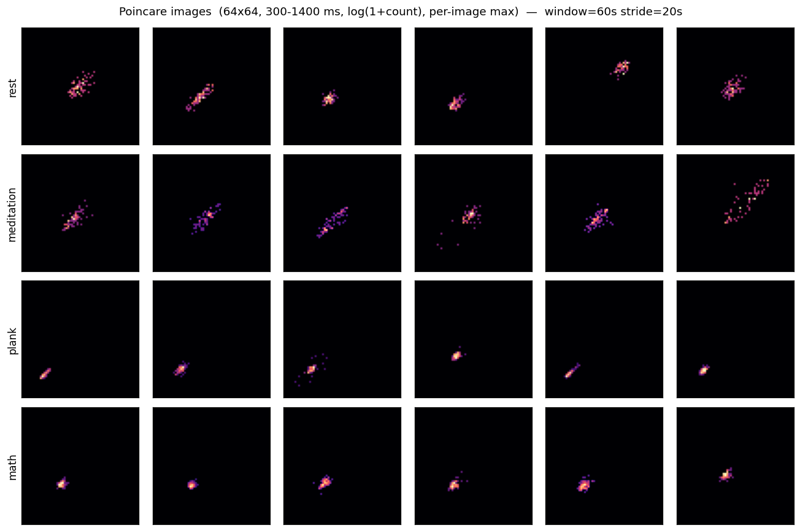

# Poincaré-image 2D-CNN — 60s window

> 4 classes: **rest / meditation / plank / math**. ECG RR (NN) Poincaré plots rendered as 64×64 log-count **images** and classified with a small 2D-CNN.
> Companion to the feature-based [`ml-report.md`](../ml-report.md), the 60s-vs-2min comparison in [`poincare-cnn-window-comparison.md`](poincare-cnn-window-comparison.md), and the Poincaré diagnostics in [`poincare-report.md`](../poincare-report.md).

## Setup

- **Image.** x = RRₙ, y = RRₙ₊₁; range 300–1400 ms; **64×64** bins; value = **log(1+count)**; **per-image max** normalization. Single channel (64×64×1).
- **Windowing.** **60-s window, 20-s stride**, each window fully inside one phase (no cross-phase mixing).
- **Boundary exclusion.** Windows overlapping the 5-min cue **[290, 310] s** or the 10-min mark **[590, 610] s** are dropped. Recovery phase dropped.
- **Partial exclusions (curator review).** `smj_6_6_math_17` removed entirely; `oyj_6_6_math_11` rest phase removed (math kept).
- **RR source.** Wavelet 5–45 Hz ECG filter → neurokit R-peaks → NN cleaning (300–1500 ms reject + 20 % median-deviation reject + cubic-spline interpolation).
- **Model.** Conv2D(16,3×3,same)→BN→ReLU→MaxPool · Conv2D(32,…)→BN→ReLU→MaxPool · Conv2D(64,…)→BN→ReLU→GAP · Dense(64)→ReLU→Dropout(0.3)→Output(4). ~28 k params.
- **Training.** Class-weighted CE, AdamW (lr 1e-3, wd 1e-4), cosine schedule, AMP on **CUDA (RTX 5090)**, early stopping on inner-val macro-F1.
- **Protocol — LORO** (leave-one-recording-out).

## Dataset

- **382 windows**, **19 recordings**, 6 subjects (LORO = 19 folds).
- Class counts:

  | rest | meditation | plank | math | total |
  |---:|---:|---:|---:|---:|
  | 216 | 66 | 23 | 77 | 382 |

## Headline — pooled-LORO

| Model | acc | macro-F1 | F1[rest] | F1[medi] | F1[plank] | F1[math] |
|---|---:|---:|---:|---:|---:|---:|
| **Poincaré 2D-CNN (60s)** | 0.562 | 0.249 | 0.611 | 0.036 | 0.090 | 0.259 |

Accuracy **0.562 ± 0.247**, macro-F1 **0.249 ± 0.125** (mean ± std across folds).

## Confusion matrix (LORO, summed across folds)



Row-normalized (rows = true class, % of that class):

| true \ pred | rest | meditation | plank | math | support |
|---|---:|---:|---:|---:|---:|
| **rest** | 62.5% | 1.4% | 0.0% | 36.1% | 216 |
| **meditation** | 75.8% | 7.6% | 0.0% | 16.7% | 66 |
| **plank** | 0.0% | 0.0% | 21.7% | 78.3% | 23 |
| **math** | 0.0% | 0.0% | 15.6% | 84.4% | 77 |

Raw counts:

| true \ pred | rest | meditation | plank | math |
|---|---:|---:|---:|---:|
| **rest** | 135 | 3 | 0 | 78 |
| **meditation** | 50 | 5 | 0 | 11 |
| **plank** | 0 | 0 | 5 | 18 |
| **math** | 0 | 0 | 12 | 65 |

## Per-fold results

| recording | test_n | macro-F1 | acc |
|---|---:|---:|---:|
| `ljh_6_5_pla_2` | 15 | 0.250 | 0.800 |
| `ljh_6_5_pla_2(1)` | 15 | 0.239 | 0.733 |
| `mta2_5_19_medi` | 23 | 0.191 | 0.435 |
| `mta_5_19_medi` | 23 | 0.100 | 0.217 |
| `mta_5_19_pla_2'20(1)` | 16 | 0.417 | 0.875 |
| `mta_5_26_math_11_13` | 23 | 0.363 | 0.739 |
| `mta_5_26_pla_3'30` | 19 | 0.290 | 0.579 |
| `mta_6_3_math_10` | 23 | 0.456 | 0.913 |
| `mta_6_3_math_10(1)` | 23 | 0.267 | 0.565 |
| `mta_6_3_math_14` | 23 | 0.381 | 0.696 |
| `mta_6_3_math_8` | 23 | 0.162 | 0.478 |
| `mta_6_4_medi` | 23 | 0.065 | 0.130 |
| `mta_6_4_medi(1)` | 23 | 0.182 | 0.522 |
| `mta_6_4_pla_2` | 15 | 0.439 | 0.867 |
| `mta_6_4_pla_2'10` | 15 | 0.184 | 0.467 |
| `nvt_5_21_medi` | 23 | 0.000 | 0.000 |
| `nvt_5_26_math_7_10` | 23 | 0.277 | 0.609 |
| `oyj_6_6_math_11` | 11 | 0.133 | 0.364 |
| `smj_5_22_medi` | 23 | 0.333 | 0.696 |

## Samples



## Reproduce

```bash
uv run python scripts/run_poincare.py
```
