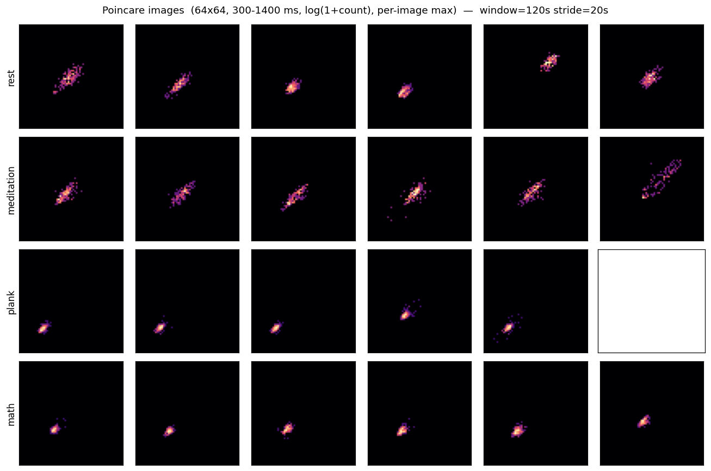

# Poincaré-image 2D-CNN — 120s window

> 4 classes: **rest / meditation / plank / math**. ECG RR (NN) Poincaré plots rendered as 64×64 log-count **images** and classified with a small 2D-CNN.
> Companion to the feature-based [`ml-report.md`](../ml-report.md), the 60s-vs-2min comparison in [`poincare-cnn-window-comparison.md`](poincare-cnn-window-comparison.md), and the Poincaré diagnostics in [`poincare-report.md`](../poincare-report.md).

## Setup

- **Image.** x = RRₙ, y = RRₙ₊₁; range 300–1400 ms; **64×64** bins; value = **log(1+count)**; **per-image max** normalization. Single channel (64×64×1).
- **Windowing.** **120-s window, 20-s stride**, each window fully inside one phase (no cross-phase mixing).
- **Boundary exclusion.** Windows overlapping the 5-min cue **[290, 310] s** or the 10-min mark **[590, 610] s** are dropped. Recovery phase dropped.
- **Partial exclusions (curator review).** `smj_6_6_math_17` removed entirely; `oyj_6_6_math_11` rest phase removed (math kept).
- **RR source.** Wavelet 5–45 Hz ECG filter → neurokit R-peaks → NN cleaning (300–1500 ms reject + 20 % median-deviation reject + cubic-spline interpolation).
- **Model.** Conv2D(16,3×3,same)→BN→ReLU→MaxPool · Conv2D(32,…)→BN→ReLU→MaxPool · Conv2D(64,…)→BN→ReLU→GAP · Dense(64)→ReLU→Dropout(0.3)→Output(4). ~28 k params.
- **Training.** Class-weighted CE, AdamW (lr 1e-3, wd 1e-4), cosine schedule, AMP on **CUDA (RTX 5090)**, early stopping on inner-val macro-F1.
- **Protocol — LORO** (leave-one-recording-out).

## Dataset

- **271 windows**, **19 recordings**, 6 subjects (LORO = 19 folds).
- Class counts:

  | rest | meditation | plank | math | total |
  |---:|---:|---:|---:|---:|
  | 162 | 48 | 5 | 56 | 271 |

## Headline — pooled-LORO

| Model | acc | macro-F1 | F1[rest] | F1[medi] | F1[plank] | F1[math] |
|---|---:|---:|---:|---:|---:|---:|
| **Poincaré 2D-CNN (120s)** | 0.571 | 0.199 | 0.524 | 0.049 | 0.000 | 0.222 |

Accuracy **0.571 ± 0.316**, macro-F1 **0.199 ± 0.123** (mean ± std across folds).

## Confusion matrix (LORO, summed across folds)


Row-normalized (rows = true class, % of that class):

| true \ pred | rest | meditation | plank | math | support |
|---|---:|---:|---:|---:|---:|
| **rest** | 63.6% | 1.2% | 0.0% | 35.2% | 162 |
| **meditation** | 77.1% | 14.6% | 0.0% | 8.3% | 48 |
| **plank** | 0.0% | 0.0% | 0.0% | 100.0% | 5 |
| **math** | 30.4% | 0.0% | 0.0% | 69.6% | 56 |

Raw counts:

| true \ pred | rest | meditation | plank | math |
|---|---:|---:|---:|---:|
| **rest** | 103 | 2 | 0 | 57 |
| **meditation** | 37 | 7 | 0 | 4 |
| **plank** | 0 | 0 | 0 | 5 |
| **math** | 17 | 0 | 0 | 39 |

## Per-fold results

| recording | test_n | macro-F1 | acc |
|---|---:|---:|---:|
| `ljh_6_5_pla_2` | 9 | 0.250 | 1.000 |
| `ljh_6_5_pla_2(1)` | 9 | 0.219 | 0.778 |
| `mta2_5_19_medi` | 17 | 0.173 | 0.529 |
| `mta_5_19_medi` | 17 | 0.028 | 0.059 |
| `mta_5_19_pla_2'20(1)` | 10 | 0.200 | 0.600 |
| `mta_5_26_math_11_13` | 17 | 0.160 | 0.471 |
| `mta_5_26_pla_3'30` | 13 | 0.000 | 0.000 |
| `mta_6_3_math_10` | 17 | 0.500 | 1.000 |
| `mta_6_3_math_10(1)` | 17 | 0.470 | 0.941 |
| `mta_6_3_math_14` | 17 | 0.173 | 0.529 |
| `mta_6_3_math_8` | 17 | 0.160 | 0.471 |
| `mta_6_4_medi` | 17 | 0.160 | 0.471 |
| `mta_6_4_medi(1)` | 17 | 0.205 | 0.529 |
| `mta_6_4_pla_2` | 9 | 0.250 | 1.000 |
| `mta_6_4_pla_2'10` | 9 | 0.000 | 0.000 |
| `nvt_5_21_medi` | 17 | 0.233 | 0.412 |
| `nvt_5_26_math_7_10` | 17 | 0.173 | 0.529 |
| `oyj_6_6_math_11` | 8 | 0.250 | 1.000 |
| `smj_5_22_medi` | 17 | 0.173 | 0.529 |

## Samples



## Reproduce

```bash
uv run python scripts/run_poincare.py --window 120 --stride 20 --tag _2min
```
