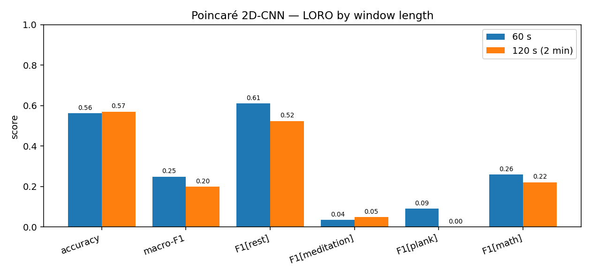
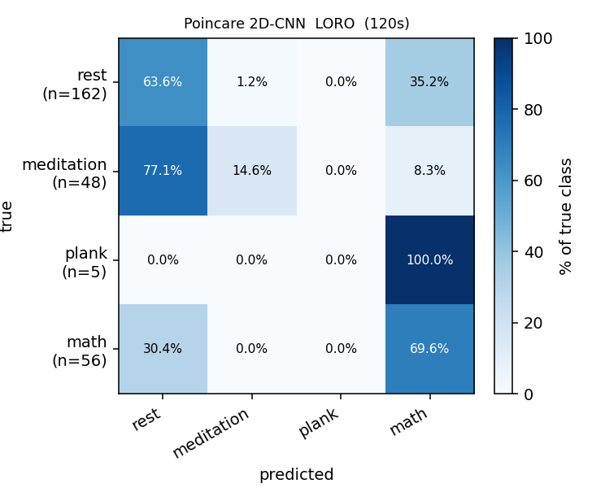

# Poincaré-image 2D-CNN — window-length comparison (60 s vs 2 min)

> Same pipeline, model, exclusions and **LORO** protocol; only the window length (and therefore the number of windows) differs. Stride fixed at 20 s. See per-run detail in [`poincare-cnn-report.md`](poincare-cnn-report.md) and [`poincare-cnn-report_2min.md`](poincare-cnn-report_2min.md).

## Dataset size by window

| window | total | rest | meditation | plank | math | folds |
|---|---:|---:|---:|---:|---:|---:|
| 60 s | 382 | 216 | 66 | 23 | 77 | 19 |
| 120 s (2 min) | 271 | 162 | 48 | 5 | 56 | 19 |

> The 2-min window is the originally-requested setting; it leaves **plank** with very few windows (the plank phases are only 120–210 s), which is the whole reason the 60-s window was adopted.

## Headline — pooled-LORO

| window | acc | macro-F1 | F1[rest] | F1[medi] | F1[plank] | F1[math] |
|---|---:|---:|---:|---:|---:|---:|
| 60 s | 0.562 | 0.249 | 0.611 | 0.036 | 0.090 | 0.259 |
| 120 s (2 min) | 0.571 | 0.199 | 0.524 | 0.049 | 0.000 | 0.222 |

### Δ (120 s (2 min) − 60 s)

| metric | 60 s | 120 s (2 min) | Δ |
|---|---:|---:|---:|
| accuracy | 0.562 | 0.571 | +0.009 |
| macro-F1 | 0.249 | 0.199 | -0.050 |
| F1[rest] | 0.611 | 0.524 | -0.086 |
| F1[meditation] | 0.036 | 0.049 | +0.014 |
| F1[plank] | 0.090 | 0.000 | -0.090 |
| F1[math] | 0.259 | 0.222 | -0.037 |

## Takeaway

1. **60 s wins on macro-F1** (0.249 vs 0.199). The 2-min window's marginally higher *accuracy* is just the majority-class effect — fewer plank/medi windows means rest dominates more, so guessing rest/math scores slightly better on raw accuracy while the balanced macro-F1 drops.
2. **2 min kills plank** (F1 0.09 → **0.00**; only 5 windows total, most plank files yield 0). This is the decisive reason to prefer the 60-s window — a 2-min window cannot fit inside the 120–210 s plank phases after boundary exclusion.
3. **Both settings are weak** in absolute terms: meditation and plank are not learned cross-recording from RR shape alone. Neither window approaches the multi-modal feature pipelines in [`ml-report.md`](../ml-report.md) (1D-CNN macro-F1 0.75). Read this as a single-modality (RR-only) baseline.
4. **Conclusion:** keep the **60-s** window for the Poincaré-image model; the 2-min spec is documented here for completeness but is strictly worse for this 4-class task.

## Chart

## Confusion heatmaps

| 60 s | 2 min |
|---|---|
|  |  |
