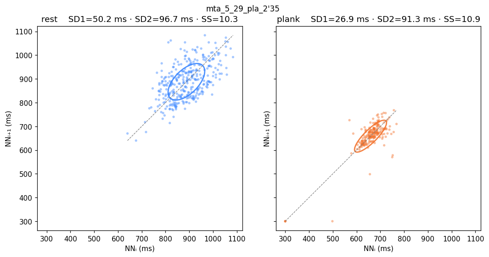

# Poincaré-plot report — NN-interval geometry per recording × phase

> Companion to [`ml-report.md`](ml-report.md). All numbers and PNGs are
> generated by [`scripts/dump_preprocessed_nn.py`](scripts/dump_preprocessed_nn.py)
> + [`scripts/plot_poincare.py`](scripts/plot_poincare.py) from
> `outputs/preprocessed_nn.json`.

## What the plot shows

For each recording, the per-recording figure plots `(NNᵢ, NNᵢ₊₁)` ms-pairs
twice: once for the **rest** phase and once for the **stressor** phase
(`meditation` / `plank` / `math`). The two panels share axes so the shape
of the cloud is directly comparable.

On each panel an SD-ellipse is drawn whose principal axes are
**SD1** (perpendicular to the identity line) and **SD2** (along it). Two
ratios are read off the cloud:

  * **SD1/SD2** — autonomic balance; lower → more sympathetic / rigid.
  * **SS (Stress Score) = 1000 / SD2** — Naranjo / Kubios convention,
    higher → narrower long-axis → more sympathetic dominance.

Formulas (from the published Kubios derivation):

```
SD1² = ½·Var(NNᵢ − NNᵢ₊₁)
SD2² = 2·Var(NNᵢ) − ½·Var(NNᵢ − NNᵢ₊₁)
```

`SD1` is proportional to RMSSD (`SD1 ≈ RMSSD / √2`); `SD2` captures the
overall NN scatter (a slow-drift index). Both are computed on per-phase NN
pools using `src.preprocess.clean_nn_intervals` (Pan–Tompkins NeuroKit
peaks → 300–2000 ms physiological window → 20 % single-step rejection).

## Setup

- 31 recordings, 10 subjects, 4 stressor categories (the `medi` files
  cover both `rest` and `meditation`; `pla` files cover `rest` and `plank`;
  `math` files cover `rest` and `math`).
- ECG R-peak detector: NeuroKit `pantompkins1985`.
- Phase split per `src.io.phase_boundaries` (rest = 0 – 300 s; stressor =
  300 s – end of stressor; recovery dropped).
- Partial exclusions from `src/exclusions.py` are applied at dump time
  — recordings whose rest phase is excluded contribute 0 NN intervals
  to the `rest` bucket. Specifically:
  - `mta_5_21_medi`, `oyj_5_22_medi_posiECG`, `nnn_5_29_pla_3`,
    `tnq_5_29_pla_2'20`, `tnq_5_29_math_7_12` — rest phase dropped.

## Aggregate (pooled across all subjects per stressor)

> Pooled NN intervals from every recording in a stressor group. This is the
> coarsest cut — useful as a sanity check, but the per-recording numbers
> below are the honest signal.

| Stressor | Phase | NN count | SD1 (ms) | SD2 (ms) | SD1/SD2 | SS |
|---|---|---:|---:|---:|---:|---:|
| medi | rest   | 2 157 | 34.7 | 108.8 | 0.318 | 9.2 |
| medi | medi   | 2 869 | 31.4 | 138.4 | 0.227 | 7.2 |
| pla  | rest   | 3 757 | 31.8 | 148.7 | 0.214 | 6.7 |
| pla  | plank  | 2 543 | 39.2 | 218.0 | 0.180 | 4.6 |
| math | rest   | 4 018 | 22.9 |  98.1 | 0.234 | 10.2 |
| math | math   | 4 938 | 17.7 |  90.8 | 0.195 | 11.0 |

**Takeaways from the pool.**

- Meditation **lengthens SD2** (109 → 138 ms) — wider spread of NN
  intervals, slower drift — and **drops SS** (9.2 → 7.2). Parasympathetic
  dominance signature.
- Math **shrinks both SD1 and SD2** (23 → 18, 98 → 91) and **raises SS**
  (10.2 → 11.0). Tighter cloud, sympathetic stress signature.
- Plank looks anomalous in the pool (SD2 *grows* 149 → 218). This is **not**
  parasympathetic activation — it's because plank phases include large
  breath-driven RSA swings (subjects gasp), which inflate SD2 without
  reflecting baseline state. Per-recording, several plank recordings show
  SD2 250+ ms while their classifier-relevant features are dominated by
  the elevated HR + raised CSI.

Aggregate figures: [`figures/poincare/_aggregate__medi.png`](figures/poincare/_aggregate__medi.png),
[`figures/poincare/_aggregate__pla.png`](figures/poincare/_aggregate__pla.png),
[`figures/poincare/_aggregate__math.png`](figures/poincare/_aggregate__math.png).

## Per-recording numbers

> `NN` is the number of cleaned NN intervals in the phase (after the
> 300–2000 ms physiological clip + 20 % single-step rejection). Rows with
> NN = 0 are partial-exclusion drops; their per-recording PNG draws only
> the stressor panel.

| Recording | Stressor | Phase | NN | SD1 (ms) | SD2 (ms) | SD1/SD2 | SS |
|---|---|---|---:|---:|---:|---:|---:|
| ljh_5_21_medi_posiECG | medi | rest | 348 | 48.6 | 156.9 | 0.310 | 6.4 |
| ljh_5_21_medi_posiECG | medi | meditation | 352 | 34.2 | 127.5 | 0.268 | 7.8 |
| mta2_5_19_medi | medi | rest | 344 | 36.1 | 81.4 | 0.444 | 12.3 |
| mta2_5_19_medi | medi | meditation | 376 | 35.8 | 94.5 | 0.378 | 10.6 |
| mta_5_19_medi | medi | rest | 381 | 22.4 | 48.9 | 0.458 | 20.4 |
| mta_5_19_medi | medi | meditation | 372 | 30.7 | 86.3 | 0.356 | 11.6 |
| mta_5_19_pla_2'20(1) | pla | rest | 368 | 29.0 | 87.1 | 0.333 | 11.5 |
| mta_5_19_pla_2'20(1) | pla | plank | 197 | 20.4 | 49.0 | 0.416 | 20.4 |
| mta_5_21_medi | medi | meditation | 330 | 26.0 | 93.1 | 0.279 | 10.7 |
| mta_5_21_pla_2 | pla | rest | 333 | 34.3 | 90.3 | 0.381 | 11.1 |
| mta_5_21_pla_2 | pla | plank | 145 | 61.5 | 241.8 | 0.254 | 4.1 |
| mta_5_21_pla_2'30 | pla | rest | 319 | 28.0 | 71.7 | 0.391 | 14.0 |
| mta_5_21_pla_2'30 | pla | plank | 187 | 58.5 | 193.5 | 0.302 | 5.2 |
| mta_5_26_math_11_13 | math | rest | 433 | 26.5 | 54.3 | 0.489 | 18.4 |
| mta_5_26_math_11_13 | math | math | 472 | 17.9 | 43.4 | 0.411 | 23.0 |
| mta_5_26_pla_3'30 | pla | rest | 442 | 24.7 | 46.9 | 0.527 | 21.3 |
| mta_5_26_pla_3'30 | pla | plank | 371 | 16.8 | 38.5 | 0.435 | 25.9 |
| mta_5_29_pla_2'35 | pla | rest | 336 | 50.2 | 96.7 | 0.519 | 10.3 |
| mta_5_29_pla_2'35 | pla | plank | 208 | 26.9 | 91.3 | 0.295 | 10.9 |
| mta_5_29_pla_4 | pla | rest | 333 | 48.8 | 100.0 | 0.488 | 10.0 |
| mta_5_29_pla_4 | pla | plank | 333 | 30.4 | 70.7 | 0.430 | 14.1 |
| mta_6_3_math_10 | math | rest | 421 | 29.7 | 63.5 | 0.468 | 15.7 |
| mta_6_3_math_10 | math | math | 458 | 17.8 | 34.5 | 0.516 | 29.0 |
| mta_6_3_math_10(1) | math | rest | 435 | 21.1 | 47.8 | 0.442 | 20.9 |
| mta_6_3_math_10(1) | math | math | 449 | 16.5 | 38.4 | 0.429 | 26.0 |
| mta_6_3_math_14 | math | rest | 410 | 27.6 | 71.4 | 0.386 | 14.0 |
| mta_6_3_math_14 | math | math | 446 | 19.7 | 39.1 | 0.505 | 25.6 |
| mta_6_3_math_8 | math | rest | 436 | 22.6 | 45.5 | 0.497 | 22.0 |
| mta_6_3_math_8 | math | math | 461 | 14.7 | 38.8 | 0.378 | 25.8 |
| nnn_5_29_math_6_8 | math | rest | 372 | 19.8 | 63.0 | 0.314 | 15.9 |
| nnn_5_29_math_6_8 | math | math | 466 | 19.5 | 51.9 | 0.375 | 19.2 |
| nnn_5_29_pla_3 | pla | plank | 183 | 41.5 | 275.1 | 0.151 | 3.6 |
| ntv_5_25_pla_2 | pla | rest | 415 | 14.4 | 35.5 | 0.407 | 28.2 |
| ntv_5_25_pla_2 | pla | plank | 116 | 26.9 | 160.6 | 0.168 | 6.2 |
| nva_5_26_math_6_8 | math | rest | 403 | 14.7 | 57.1 | 0.258 | 17.5 |
| nva_5_26_math_6_8 | math | math | 440 | 15.0 | 90.9 | 0.165 | 11.0 |
| nva_5_26_math_9_12 | math | rest | 395 | 17.3 | 65.1 | 0.266 | 15.4 |
| nva_5_26_math_9_12 | math | math | 412 | 22.8 | 60.1 | 0.380 | 16.6 |
| nvt_5_21_medi | medi | rest | 329 | 22.9 | 40.1 | 0.572 | 24.9 |
| nvt_5_21_medi | medi | meditation | 316 | 37.1 | 163.0 | 0.227 | 6.1 |
| nvt_5_25_pla_3'30 | pla | rest | 380 | 15.9 | 33.8 | 0.469 | 29.6 |
| nvt_5_25_pla_3'30 | pla | plank | 197 | 21.3 | 254.5 | 0.084 | 3.9 |
| nvt_5_26_math_7_10 | math | rest | 359 | 21.2 | 34.0 | 0.625 | 29.4 |
| nvt_5_26_math_7_10 | math | math | 398 | 16.3 | 40.5 | 0.401 | 24.7 |
| nvt_5_26_math_7_11 | math | rest | 354 | 21.1 | 44.5 | 0.474 | 22.5 |
| nvt_5_26_math_7_11 | math | math | 403 | 18.5 | 62.4 | 0.296 | 16.0 |
| nvt_5_29_medi | medi | rest | 367 | 33.2 | 65.0 | 0.510 | 15.4 |
| nvt_5_29_medi | medi | meditation | 375 | 28.3 | 71.6 | 0.396 | 14.0 |
| oyj_5_22_medi_posiECG | medi | meditation | 351 | 19.3 | 85.0 | 0.227 | 11.8 |
| smj_5_22_medi | medi | rest | 388 | 36.8 | 59.4 | 0.620 | 16.8 |
| smj_5_22_medi | medi | meditation | 397 | 32.3 | 136.5 | 0.236 | 7.3 |
| smj_5_22_pla_2 | pla | rest | 387 | 32.9 | 60.8 | 0.541 | 16.5 |
| smj_5_22_pla_2 | pla | plank | 165 | 20.5 | 187.0 | 0.109 | 5.3 |
| smj_5_22_pla_2'5 | pla | rest | 444 | 25.1 | 70.8 | 0.355 | 14.1 |
| smj_5_22_pla_2'5 | pla | plank | 180 | 28.2 | 250.6 | 0.113 | 4.0 |
| tnq_5_29_math_7_12 | math | math | 533 | 9.7 | 47.5 | 0.204 | 21.1 |
| tnq_5_29_pla_2'20 | pla | plank | 261 | 21.7 | 275.3 | 0.079 | 3.6 |

## Per-recording PNGs

All under [`figures/poincare/`](figures/poincare/). One 1×2 figure per
recording (rest | stressor), sharing axes, with the SD-ellipse drawn over
each cloud. Examples:

| Meditation | Plank | Math |
|---|---|---|
|  |  |  |

## Reading guide

Patterns to look for when scanning a recording's PNG:

- **Meditation → SD2 grows, ellipse stretches along the identity line.**
  See `nvt_5_21_medi`, `ljh_5_21_medi_posiECG`, `smj_5_22_medi` — SD2
  doubles from rest to meditation.
- **Math → ellipse shrinks (both SD1 & SD2 down), SS rises.** See
  `mta_6_3_math_*` (4 recordings, all consistent): SD2 drops ~30 %.
- **Plank → ellipse usually grows on SD2 *because* of large RSA peaks
  during effort.** This means SD2/SD1 alone is *not* a reliable plank
  indicator — the classifier leans on HR + CSI + RR for that class.
- **Anomalies worth eyeballing**:
  - `mta_5_21_pla_2*`: SD2 climbs from ~80 to ~240 in plank — heavy
    respiratory artifact, the BR detector handles it but Poincaré is
    pulled by the slow drift.
  - `nvt_5_25_pla_3'30`: SD1/SD2 collapses to 0.084 in plank — extreme
    sympathetic dominance.
  - `tnq_5_29_math_7_12` rest is excluded (partial exclusion); math panel
    shows the tightest math cloud in the set (SD1 = 9.7 ms).

## Why these features (vs LF / HF / LF-HF)

LF / HF / LF-HF were removed because Welch on a 40 s NN tachogram has
spectral resolution worse than the LF band itself. SD1 / SD2 / SS are
pure time-domain statistics computed from the NN sequence — they degrade
gracefully at 40 s and are reported reliable from ≥ 60 s windows, which
the new windowing scheme uses (`FEATURE_WINDOWS_S["sd1"] = 60.0`, etc.
— see `src/features.py`).
