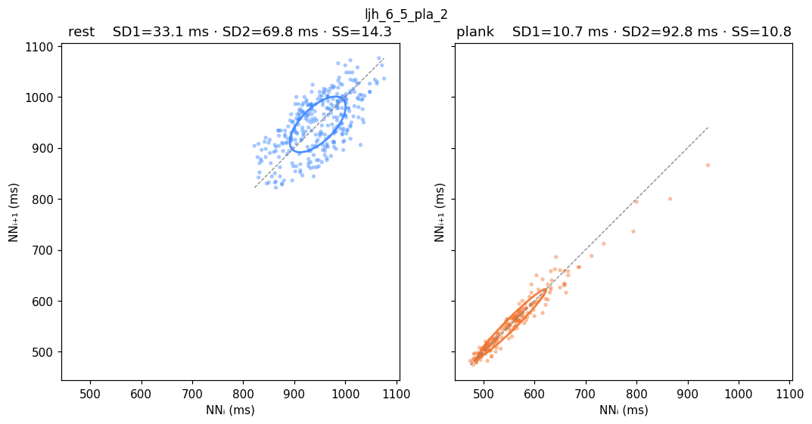

# Poincaré-plot report — NN-interval geometry per recording × phase

> Companion to [`ml-report.md`](ml-report.md). Numbers and PNGs are
> generated by [`scripts/dump_preprocessed_nn.py`](../scripts/dump_preprocessed_nn.py)
> + [`scripts/plot_poincare.py`](../scripts/plot_poincare.py) from
> `outputs/preprocessed_nn.json`.

## What the plot shows

For each recording the figure plots `(NNᵢ, NNᵢ₊₁)` ms-pairs twice — once
for **rest** and once for the **stressor** phase (`meditation` /
`plank` / `math`). The two panels share axes so the cloud shape is
directly comparable. An SD-ellipse with axes **SD1** (perpendicular to
the identity line) and **SD2** (along it) is drawn over each cloud.

Three quantities derived from `SD1` and `SD2` are fed to the ML model:

  * **SD2 / SD1** — autonomic balance ratio; higher → more sympathetic /
    rigid (long axis dwarfs short axis).
  * **SD1 · SD2** — Poincaré ellipse area divided by π (units ms²);
    lower → tighter overall NN scatter.
  * **SS = 1000 / SD2** — Naranjo / Kubios stress score; higher SS = more
    sympathetic dominance.

`SD1` is not used as a feature directly (it is proportional to `RMSSD`,
already in the feature set). `SD2` is not used directly (`SS = 1000/SD2`).

Formulas (Kubios derivation):

```
SD1² = ½·Var(NNᵢ − NNᵢ₊₁)
SD2² = 2·Var(NNᵢ) − ½·Var(NNᵢ − NNᵢ₊₁)
```

## Setup

- **20 recordings, 5 subjects** (`mta` ×12, `mta2`, `ljh` ×2, `nvt` ×2,
  `oyj`, `smj` ×2). Subjects per stressor: medi 4 (mta, mta2, nvt, smj);
  plank 2 (mta + ljh); math 4 (mta, nvt, oyj, smj).
- ECG R-peaks: NeuroKit `pantompkins1985` on the wavelet-filtered signal
  (sym4 DWT, soft-threshold denoise, 5–45 Hz band-keep — see
  [`src/preprocess.py:filter_ecg`](../src/preprocess.py)).
- BR peaks: sliding-window local-p90 (default).
- No partial exclusions.

## Aggregate (pooled across recordings per stressor)

| Stressor | Phase | NN count | SD1 (ms) | SD2 (ms) | SD2/SD1 | SD1·SD2 (ms²) | SS |
|---|---|---:|---:|---:|---:|---:|---:|
| medi | rest    | 2 218 | 29.3 |  99.6 | 3.40 | 2 919 | 10.0 |
| medi | medi    | 2 231 | 30.8 | 138.4 | 4.50 | 4 258 |  7.2 |
| pla  | rest    | 2 186 | 29.0 | 161.8 | 5.58 | 4 689 |  6.2 |
| pla  | plank   | 1 413 | 18.3 |  96.6 | 5.28 | 1 766 | 10.4 |
| math | rest    | 3 280 | 24.0 |  87.9 | 3.66 | 2 109 | 11.4 |
| math | math    | 3 544 | 18.6 |  66.5 | 3.57 | 1 239 | 15.0 |

**Reading the pool.**

- Meditation stretches SD2 (100 → 138 ms) and drops SS (10 → 7.2) —
  parasympathetic activation.
- Math shrinks both axes; ellipse area (`SD1·SD2`) halves (2 109 →
  1 239 ms²); SS rises (11.4 → 15.0) — sympathetic stress.
- Plank shrinks `SD1·SD2` even more sharply (4 689 → 1 766) — but the
  plank-rest SD2 baseline is unusually high (162 ms) because the two
  `ljh_6_5_pla_*` recordings start with very wide rest variability.

Aggregate figures: [`figures/poincare/_aggregate__medi.png`](figures/poincare/_aggregate__medi.png),
[`figures/poincare/_aggregate__pla.png`](figures/poincare/_aggregate__pla.png),
[`figures/poincare/_aggregate__math.png`](figures/poincare/_aggregate__math.png).

## Per-recording numbers

| Recording | Stressor | Phase | NN | SD1 (ms) | SD2 (ms) | SD2/SD1 | SD1·SD2 (ms²) | SS |
|---|---|---|---:|---:|---:|---:|---:|---:|
| ljh_6_5_pla_2         | pla  | rest        | 316 | 33.1 |  69.8 | 2.11 | 2 312 | 14.3 |
| ljh_6_5_pla_2         | pla  | plank       | 214 | 10.7 |  92.8 | 8.66 |   995 | 10.8 |
| ljh_6_5_pla_2(1)      | pla  | rest        | 304 | 25.7 |  64.7 | 2.52 | 1 667 | 15.4 |
| ljh_6_5_pla_2(1)      | pla  | plank       | 228 |  7.1 |  70.7 | 9.96 |   502 | 14.1 |
| mta2_5_19_medi        | medi | rest        | 344 | 35.8 |  81.2 | 2.27 | 2 910 | 12.3 |
| mta2_5_19_medi        | medi | meditation  | 374 | 31.9 |  94.1 | 2.95 | 3 001 | 10.6 |
| mta_5_19_medi         | medi | rest        | 381 | 22.5 |  49.0 | 2.18 | 1 101 | 20.4 |
| mta_5_19_medi         | medi | meditation  | 377 | 29.2 |  82.4 | 2.82 | 2 405 | 12.1 |
| mta_5_19_pla_2'20(1)  | pla  | rest        | 368 | 28.8 |  87.0 | 3.02 | 2 507 | 11.5 |
| mta_5_19_pla_2'20(1)  | pla  | plank       | 199 | 21.8 |  45.5 | 2.09 |   991 | 22.0 |
| mta_5_26_math_11_13   | math | rest        | 433 | 26.1 |  53.9 | 2.07 | 1 408 | 18.5 |
| mta_5_26_math_11_13   | math | math        | 472 | 17.5 |  43.2 | 2.47 |   757 | 23.1 |
| mta_5_26_pla_3'30     | pla  | rest        | 443 | 28.0 |  55.5 | 1.98 | 1 553 | 18.0 |
| mta_5_26_pla_3'30     | pla  | plank       | 370 | 16.6 |  40.3 | 2.43 |   670 | 24.8 |
| mta_6_3_math_10       | math | rest        | 421 | 29.2 |  62.9 | 2.15 | 1 837 | 15.9 |
| mta_6_3_math_10       | math | math        | 458 | 17.7 |  34.4 | 1.95 |   607 | 29.1 |
| mta_6_3_math_10(1)    | math | rest        | 435 | 20.8 |  47.3 | 2.28 |   983 | 21.1 |
| mta_6_3_math_10(1)    | math | math        | 449 | 15.7 |  38.1 | 2.42 |   600 | 26.2 |
| mta_6_3_math_14       | math | rest        | 410 | 27.4 |  71.3 | 2.60 | 1 951 | 14.0 |
| mta_6_3_math_14       | math | math        | 446 | 21.0 |  38.9 | 1.85 |   819 | 25.7 |
| mta_6_3_math_8        | math | rest        | 436 | 21.7 |  45.2 | 2.08 |   980 | 22.1 |
| mta_6_3_math_8        | math | math        | 461 | 14.5 |  38.7 | 2.67 |   561 | 25.8 |
| mta_6_4_medi          | medi | rest        | 381 | 29.0 |  65.8 | 2.27 | 1 911 | 15.2 |
| mta_6_4_medi          | medi | meditation  | 376 | 27.4 |  81.2 | 2.97 | 2 221 | 12.3 |
| mta_6_4_medi(1)       | medi | rest        | 395 | 23.9 |  74.2 | 3.11 | 1 772 | 13.5 |
| mta_6_4_medi(1)       | medi | meditation  | 391 | 21.6 |  77.8 | 3.60 | 1 685 | 12.8 |
| mta_6_4_pla_2         | pla  | rest        | 371 | 29.8 |  73.6 | 2.47 | 2 192 | 13.6 |
| mta_6_4_pla_2         | pla  | plank       | 196 | 13.3 |  53.3 | 4.01 |   709 | 18.8 |
| mta_6_4_pla_2'10      | pla  | rest        | 384 | 25.0 |  64.1 | 2.57 | 1 599 | 15.6 |
| mta_6_4_pla_2'10      | pla  | plank       | 206 | 16.5 |  37.2 | 2.26 |   613 | 26.9 |
| nvt_5_21_medi         | medi | rest        | 329 | 24.3 |  40.5 | 1.67 |   983 | 24.7 |
| nvt_5_21_medi         | medi | meditation  | 316 | 38.4 | 163.2 | 4.25 | 6 272 |  6.1 |
| nvt_5_26_math_7_10    | math | rest        | 359 | 21.2 |  33.8 | 1.59 |   718 | 29.6 |
| nvt_5_26_math_7_10    | math | math        | 398 | 16.5 |  40.5 | 2.46 |   666 | 24.7 |
| oyj_6_6_math_11       | math | rest        | 378 | 14.9 |  49.7 | 3.33 |   740 | 20.1 |
| oyj_6_6_math_11       | math | math        | 422 | 14.6 |  67.6 | 4.64 |   985 | 14.8 |
| smj_5_22_medi         | medi | rest        | 388 | 36.4 |  59.2 | 1.63 | 2 154 | 16.9 |
| smj_5_22_medi         | medi | meditation  | 397 | 32.0 | 136.9 | 4.27 | 4 387 |  7.3 |
| smj_6_6_math_17       | math | rest        | 408 | 23.7 |  68.8 | 2.90 | 1 632 | 14.5 |
| smj_6_6_math_17       | math | math        | 438 | 26.5 |  51.9 | 1.96 | 1 377 | 19.3 |

## Per-recording PNGs

All under [`figures/poincare/`](figures/poincare/). One 1×2 figure per
recording (rest | stressor) with shared axes and SD-ellipse overlay.
Examples:

| Meditation | Plank | Math |
|---|---|---|
|  |  |  |

## Reading guide

- **Meditation → SD2 grows, ellipse stretches along the identity line.**
  Clearest in `nvt_5_21_medi` (SD2 40 → 163), `smj_5_22_medi` (59 → 137).
- **Math → both axes shrink, ellipse area collapses.** The `mta_6_3_math_*`
  recordings drop `SD1·SD2` by ~3× and SS roughly doubles.
- **`ljh_6_5_pla_*` plank is unusual** — SD2/SD1 explodes to 8.7 / 9.96
  because SD1 collapses to ~7-11 ms (very tight beat-to-beat regularity)
  while SD2 stays high. Interpret with care — this is a single subject's
  signature, not a general plank pattern.
- **High inter-subject baseline variance.** `nvt_5_21_medi` rest (SD2 40)
  vs `mta2_5_19_medi` rest (SD2 81) — same "rest" label, 2× difference.
  This is why the ML model uses ratios (`sd2_sd1`, `ss`) more than raw
  amplitudes.
