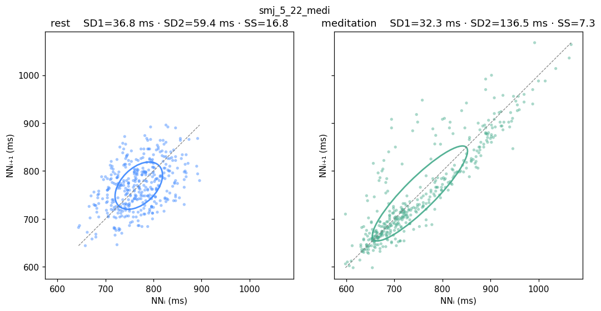
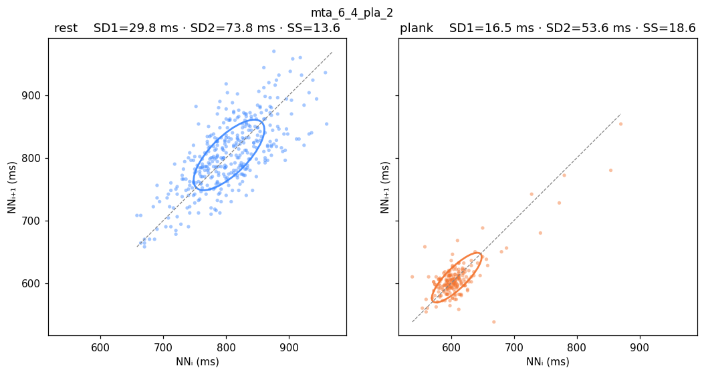
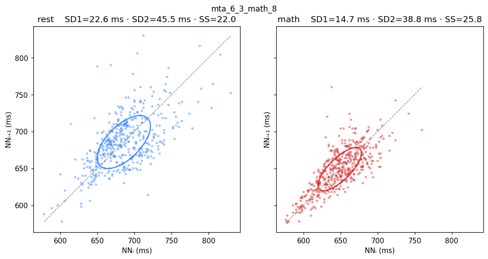

# Poincaré-plot report — NN-interval geometry per recording × phase

> Companion to [`ml-report.md`](ml-report.md). Numbers and PNGs are
> generated by [`scripts/dump_preprocessed_nn.py`](../scripts/dump_preprocessed_nn.py)
> + [`scripts/plot_poincare.py`](../scripts/plot_poincare.py) from
> `outputs/preprocessed_nn.json`.

## What the plot shows

For each recording the figure plots `(NNᵢ, NNᵢ₊₁)` ms-pairs twice — once
for **rest** and once for the **stressor** phase (`meditation` /
`plank` / `math`). The two panels share axes so the cloud shape is
directly comparable. An SD-ellipse with axes **SD1** (perpendicular to
the identity line) and **SD2** (along it) is drawn over each cloud.

Three quantities derived from `SD1` and `SD2` are used downstream as
features for the ML model — see [`ml-report.md`](ml-report.md#setup):

  * **SD2 / SD1** — autonomic balance ratio; higher → more sympathetic /
    rigid (the long axis dwarfs the short axis).
  * **SD1 · SD2** — Poincaré ellipse area divided by π (units ms²);
    lower → tighter overall NN scatter.
  * **SS = 1000 / SD2** — Naranjo / Kubios stress score; higher SS = more
    sympathetic dominance.

`SD1` is *not* used as a feature directly (it is proportional to `RMSSD`
which is already in the feature set). `SD2` is not used as a feature
directly (it is the reciprocal of `SS`).

Formulas (Kubios derivation):

```
SD1² = ½·Var(NNᵢ − NNᵢ₊₁)
SD2² = 2·Var(NNᵢ) − ½·Var(NNᵢ − NNᵢ₊₁)
```

## Setup

- 16 recordings — the curated "good-file" set the user picked from the
  GDrive folders after reviewing the previous Poincaré sweep. 4 subjects:
  `mta` (12), `mta2` (1), `nvt` (2), `smj` (1).
- Stressor counts: 6 medi + 4 plank + 6 math.
- ECG R-peaks: NeuroKit `pantompkins1985`. BR peaks: sliding-window local
  p90 (`BR_PEAK_METHOD=sliding`, the project default).
- No partial exclusions — the good-file set is treated as fully clean.

## Aggregate (pooled across recordings per stressor)

| Stressor | Phase | NN count | SD1 (ms) | SD2 (ms) | SD2/SD1 | SD1·SD2 (ms²) | SS |
|---|---|---:|---:|---:|---:|---:|---:|
| medi | rest    | 2 218 | 29.4 |  99.6 | 3.39 | 2 925 | 10.0 |
| medi | medi    | 2 228 | 31.4 | 138.7 | 4.42 | 4 355 |  7.2 |
| pla  | rest    | 1 565 | 27.2 | 107.4 | 3.95 | 2 924 |  9.3 |
| pla  | plank   |   970 | 18.0 |  82.9 | 4.60 | 1 495 | 12.1 |
| math | rest    | 2 494 | 25.3 |  87.8 | 3.46 | 2 223 | 11.4 |
| math | math    | 2 684 | 17.4 |  65.2 | 3.74 | 1 137 | 15.3 |

**Reading the pool.**

- Meditation **stretches SD2** (100 → 139 ms) and lowers SS (10 → 7.2) —
  parasympathetic activation, the canonical Poincaré "open ellipse" sign.
- Math **shrinks both axes** (SD1 25 → 17, SD2 88 → 65), the ellipse
  area `SD1·SD2` halves (2 223 → 1 137 ms²), SS rises (11.4 → 15.3) —
  sympathetic stress.
- Plank shrinks `SD1·SD2` similarly (2 924 → 1 495 ms²) but the per-axis
  pattern is mixed because plank's breath-driven RSA inflates SD2 in
  some subjects. The ratio SD2/SD1 still rises, confirming sympathetic
  dominance — see the per-recording numbers below.

Aggregate figures: [`figures/poincare/_aggregate__medi.png`](figures/poincare/_aggregate__medi.png),
[`figures/poincare/_aggregate__pla.png`](figures/poincare/_aggregate__pla.png),
[`figures/poincare/_aggregate__math.png`](figures/poincare/_aggregate__math.png).

## Per-recording numbers

| Recording | Stressor | Phase | NN | SD1 (ms) | SD2 (ms) | SD2/SD1 | SD1·SD2 (ms²) | SS |
|---|---|---|---:|---:|---:|---:|---:|---:|
| mta2_5_19_medi        | medi | rest        | 344 | 36.1 |  81.4 | 2.25 | 2 943 | 12.3 |
| mta2_5_19_medi        | medi | meditation  | 376 | 35.8 |  94.5 | 2.64 | 3 380 | 10.6 |
| mta_5_19_medi         | medi | rest        | 381 | 22.4 |  48.9 | 2.18 | 1 097 | 20.4 |
| mta_5_19_medi         | medi | meditation  | 372 | 30.7 |  86.3 | 2.81 | 2 651 | 11.6 |
| mta_5_19_pla_2'20(1)  | pla  | rest        | 368 | 29.0 |  87.1 | 3.01 | 2 522 | 11.5 |
| mta_5_19_pla_2'20(1)  | pla  | plank       | 197 | 20.4 |  49.0 | 2.40 |   998 | 20.4 |
| mta_5_26_math_11_13   | math | rest        | 433 | 26.5 |  54.3 | 2.05 | 1 438 | 18.4 |
| mta_5_26_math_11_13   | math | math        | 472 | 17.9 |  43.4 | 2.43 |   775 | 23.0 |
| mta_5_26_pla_3'30     | pla  | rest        | 442 | 24.7 |  46.9 | 1.90 | 1 158 | 21.3 |
| mta_5_26_pla_3'30     | pla  | plank       | 371 | 16.8 |  38.5 | 2.30 |   646 | 25.9 |
| mta_6_3_math_10       | math | rest        | 421 | 29.7 |  63.5 | 2.14 | 1 888 | 15.7 |
| mta_6_3_math_10       | math | math        | 458 | 17.8 |  34.5 | 1.94 |   613 | 29.0 |
| mta_6_3_math_10(1)    | math | rest        | 435 | 21.1 |  47.8 | 2.26 | 1 009 | 20.9 |
| mta_6_3_math_10(1)    | math | math        | 449 | 16.5 |  38.4 | 2.33 |   633 | 26.0 |
| mta_6_3_math_14       | math | rest        | 410 | 27.6 |  71.4 | 2.59 | 1 967 | 14.0 |
| mta_6_3_math_14       | math | math        | 446 | 19.7 |  39.1 | 1.98 |   772 | 25.6 |
| mta_6_3_math_8        | math | rest        | 436 | 22.6 |  45.5 | 2.01 | 1 029 | 22.0 |
| mta_6_3_math_8        | math | math        | 461 | 14.7 |  38.8 | 2.64 |   569 | 25.8 |
| mta_6_4_medi          | medi | rest        | 381 | 29.4 |  66.1 | 2.24 | 1 946 | 15.1 |
| mta_6_4_medi          | medi | meditation  | 376 | 26.6 |  81.9 | 3.07 | 2 183 | 12.2 |
| mta_6_4_medi(1)       | medi | rest        | 395 | 23.9 |  74.2 | 3.11 | 1 773 | 13.5 |
| mta_6_4_medi(1)       | medi | meditation  | 391 | 21.6 |  77.8 | 3.61 | 1 677 | 12.9 |
| mta_6_4_pla_2         | pla  | rest        | 371 | 29.8 |  73.8 | 2.47 | 2 201 | 13.6 |
| mta_6_4_pla_2         | pla  | plank       | 196 | 16.5 |  53.6 | 3.25 |   885 | 18.6 |
| mta_6_4_pla_2'10      | pla  | rest        | 384 | 25.5 |  64.3 | 2.52 | 1 641 | 15.5 |
| mta_6_4_pla_2'10      | pla  | plank       | 206 | 13.2 |  33.7 | 2.56 |   445 | 29.6 |
| nvt_5_21_medi         | medi | rest        | 329 | 22.9 |  40.1 | 1.75 |   919 | 24.9 |
| nvt_5_21_medi         | medi | meditation  | 316 | 37.1 | 163.0 | 4.40 | 6 040 |  6.1 |
| nvt_5_26_math_7_10    | math | rest        | 359 | 21.2 |  34.0 | 1.60 |   721 | 29.4 |
| nvt_5_26_math_7_10    | math | math        | 398 | 16.3 |  40.5 | 2.49 |   659 | 24.7 |
| smj_5_22_medi         | medi | rest        | 388 | 36.8 |  59.4 | 1.61 | 2 185 | 16.8 |
| smj_5_22_medi         | medi | meditation  | 397 | 32.3 | 136.5 | 4.23 | 4 403 |  7.3 |

## Per-recording PNGs

All under [`figures/poincare/`](figures/poincare/). One 1×2 figure per
recording (rest | stressor) with shared axes and SD-ellipse overlay.
Examples:

| Meditation | Plank | Math |
|---|---|---|
|  |  |  |

## Reading guide

- **Meditation → SD2 grows, ellipse stretches along the identity line.**
  Clearest in `nvt_5_21_medi` (SD2 40 → 163) and `smj_5_22_medi` (59 → 137).
- **Math → both axes shrink, ellipse area collapses.** The `mta_6_3_math_*`
  recordings drop `SD1·SD2` by ~3× and SS roughly doubles.
- **Plank also shrinks the ellipse area** in this curated set. SD2/SD1
  stays elevated, confirming sympathetic dominance during effort.
- **High inter-subject baseline variance** — compare `nvt_5_21_medi` rest
  (SD2 40 ms) to `mta2_5_19_medi` rest (SD2 81 ms): same "rest" label,
  2× difference. This is why the ML model uses ratios (`sd2_sd1`, `ss`)
  more than raw amplitudes.
